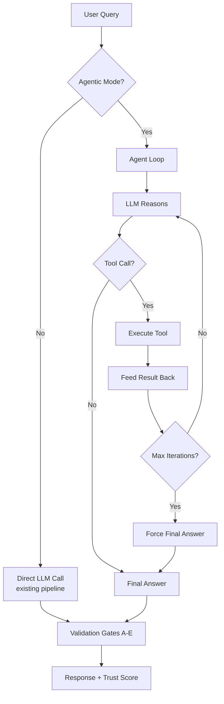
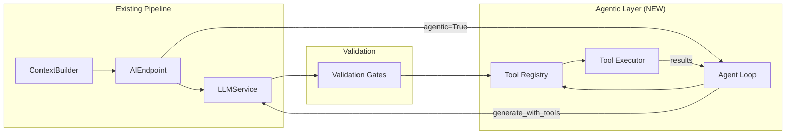

# Agentic AI Architecture

> **Status:** Tier 1 Implementation
> **Related:** [AI Implementation](ai-implementation.md) | [Context Builder](ai-context-builder.md) | [Trust & Validation Gates](ai-validation-gates.md) | [Memory Inspection](ai-memory-inspection.md)

The HOMEPOT diagnostic system currently operates as a single-turn RAG pipeline: the LLM receives rich context, generates a response, and stops. Agentic AI extends this to a **multi-step reasoning loop** where the LLM can autonomously query additional data sources, investigate hunches, and build up evidence before answering — mimicking how a human technician would diagnose a problem.

## Overview

Agentic AI adds three capabilities to the existing system:

1. **Tool Use** — The LLM can call predefined functions to fetch specific data on demand, rather than relying solely on pre-assembled context.
2. **Reasoning Loops** — The LLM follows a ReAct (Reasoning + Acting) pattern: think about what data it needs, fetch it, observe the result, and continue reasoning.
3. **Autonomous Investigation** — For complex queries, the agent decomposes the problem into subtasks and executes them iteratively until it has enough evidence to answer confidently.



## Architecture

The agent layer sits between the existing `ContextBuilder` (pre-assembled context) and the `LLMService` (text generation). It does NOT replace either — it adds an optional multi-step loop that can request additional data beyond what `build_enriched_context()` provides.



### Key Design Principles

- **Non-breaking**: The existing single-turn pipeline remains the default. Agentic mode is opt-in via `agentic: true` in the API request.
- **Graceful degradation**: If the agent loop fails or the model produces malformed tool calls, the system falls back to the direct LLM call with whatever context was already assembled.
- **Trust-gated tools**: Each tool execution is validated through the existing gate framework before its results are fed back to the LLM.
- **Budget-bounded**: The agent loop is hard-capped at 5 iterations and 60 seconds total to prevent runaway inference.

## Tool Registry

The agent has access to 8 tools that map to existing `ContextBuilder` methods and database queries. These are defined as Python functions with type hints and docstrings — the Ollama SDK auto-generates JSON schema from them.

| Tool | Function | Source | Purpose |
|------|----------|--------|---------|
| Device Status | `get_device_status(device_id)` | `ContextBuilder.get_device_context()` | Check device health on demand |
| Device Metrics | `get_device_metrics(device_id, metric)` | `ContextBuilder.get_metrics_context()` | Drill into specific CPU/memory/disk metrics |
| Error Logs | `get_error_logs(device_id, limit)` | `ContextBuilder.get_error_context()` | Investigate recent errors |
| Command History | `get_command_history(device_id)` | `ContextBuilder.get_command_context()` | Check what commands were already tried |
| Config History | `get_config_history(device_id)` | `ContextBuilder.get_config_context()` | Check recent configuration changes |
| Similar Incidents | `search_similar_incidents(query)` | `DeviceMemory.query_similar()` | Find past solutions via vector search |
| Fleet Summary | `get_fleet_summary()` | Fleet SQL query | Check fleet-wide impact of an issue |
| Active Alerts | `get_alerts(severity)` | Alert query | Correlate alerts across devices |

### Tool Definition Pattern

Each tool is defined as a Python function following this pattern:

```python
def get_device_status(device_id: str) -> str:
    """Check the current status and health of a specific device.

    Args:
        device_id: The device identifier (e.g., 'POS-001')

    Returns:
        A summary of the device's status including online/offline,
        health state, last heartbeat, and any active issues.
    """
    # Implementation queries the database via ContextBuilder
```

Ollama's SDK reads the function signature and docstring to generate the tool schema automatically. No manual JSON schema definition is needed.

## Agent Loop (ReAct Pattern)

The agent follows the ReAct (Reasoning + Acting) pattern from Yao et al., 2022:


### Loop Implementation

```python
MAX_ITERATIONS = 5
TOTAL_TIMEOUT = 60  # seconds

async def agent_loop(query: str, context: str, tools: list) -> str:
    messages = [
        {"role": "system", "content": system_prompt},
        {"role": "user", "content": f"Context:\n{context}\n\nQuestion: {query}"},
    ]

    for iteration in range(MAX_ITERATIONS):
        response = await llm.generate_with_tools(
            messages=messages,
            tools=tools,
        )

        messages.append(response.message)

        if not response.message.tool_calls:
            return response.message.content  # Final answer

        for call in response.message.tool_calls:
            result = await execute_tool(call.function.name, call.function.arguments)
            messages.append({
                "role": "tool",
                "tool_name": call.function.name,
                "content": str(result),
            })

    return "Max iterations reached. Here is what I found so far: ..."
```

### Termination Conditions

The agent loop stops when:

1. **No tool calls**: The LLM produces a text response without requesting any tools — this is the final answer.
2. **Max iterations**: 5 iterations reached without a final answer. The agent returns a partial answer with what it found.
3. **Timeout**: 60 seconds total elapsed. The agent returns whatever it has.
4. **Tool failure**: A critical tool fails. The agent continues with available data.
5. **Validation gate failure**: A tool output fails Gate B (data integrity). The agent is informed and may try a different approach.

## Integration with Validation Gates

The existing validation gate framework provides safety for agentic tool use:

### Tool Output Validation

After each tool execution, the result passes through Gate B (data integrity) to verify the data is fresh and complete:

```python
async def execute_tool_with_validation(tool_name, args):
    result = await execute_tool(tool_name, args)

    # Run Gate B on tool output
    gate_b = GateB()
    gate_result = await gate_b.run(GateContext(
        assembled_context=result,
        # ... other context fields
    ))

    if gate_result.status == GateStatus.FAIL:
        return f"[Data quality warning] {result}\n\nTrust: Low — data may be stale or incomplete."

    return result
```

### Tool Proposal Validation

For tools that modify state (e.g., future `trigger_device_action`), Gate D (permission) and Gate E (lifecycle) are checked BEFORE execution:

```python
async def execute_modifying_tool(tool_name, args, device_id):
    # Pre-check: does the device have the required permissions?
    gate_d = GateD()
    gate_result = await gate_d.run(GateContext(device_id=device_id, ...))

    if gate_result.status == GateStatus.FAIL:
        return f"Action blocked: {gate_result.failure_reason}"

    return await execute_tool(tool_name, args)
```

## API Integration

### Request Format

The existing `/api/v1/ai/query` endpoint gains an optional `agentic` field:

```json
{
    "query": "Why is POS-001 having intermittent connectivity issues?",
    "device_id": "POS-001",
    "agentic": true
}
```

### Response Format

The response includes additional fields when agentic mode is used:

```json
{
    "response": "Based on my investigation...",
    "trust": { ... },
    "agentic": {
        "iterations": 3,
        "tools_called": [
            {"tool": "get_device_status", "iteration": 1},
            {"tool": "get_error_logs", "iteration": 2},
            {"tool": "get_command_history", "iteration": 3}
        ],
        "total_duration_ms": 4500
    }
}
```

### Backward Compatibility

- `agentic: false` (default) — uses the existing single-turn pipeline. No behavioral change.
- `agentic: true` — routes through the agent loop. Same enriched context, plus additional tool calls.
- If the agent loop fails, falls back to the direct pipeline with a warning.

## Hardware Requirements

| Component | VRAM | Notes |
|---|---|---|
| `llama3.2:3B` (Q4_K_M) | ~2.0 GB | Current model, unchanged |
| Agent loop overhead | ~0 MB | Same model, just more API calls |
| **Total** | **~2.0 GB** | Fits within Quadro P620 (4 GB) |

The agent loop uses the same model — it simply makes multiple calls instead of one. The additional cost is latency (more inference calls) not memory.

### Latency Budget

| Phase | Time |
|---|---|
| Context assembly (existing) | ~2-3s |
| LLM call (iteration 1) | ~3-5s |
| Tool execution | ~0.5-1s |
| LLM call (iteration 2) | ~3-5s |
| Tool execution | ~0.5-1s |
| LLM call (iteration 3) | ~3-5s |
| **Total (3-iteration agent)** | **~12-20s** |

For comparison, the direct pipeline (single LLM call) takes ~5-8s. Agentic mode adds 7-12s for complex queries.

## Limitations

| Limitation | Impact | Mitigation |
|---|---|---|
| 3B model produces unreliable tool calls | May hallucinate tool names or arguments | Fallback to regex extraction from text; log malformed calls |
| 5-iteration cap | Complex multi-device diagnostics may be truncated | Increase cap for specific query types in future |
| No parallel tool calls | Sequential tool execution adds latency | Group related data into single tools |
| No self-reflection | Agent cannot evaluate its own reasoning quality | Validation gates provide external quality check |
| No human-in-the-loop | Agent executes autonomously | Future: add confirmation step for modifying actions |
| Context window pressure | Each tool result adds to context | Truncate tool results to 500 chars, prioritize recent |

## Implementation Tiers

| Tier | Model | Tool Calling | Effort | Status |
|---|---|---|---|---|
| **Tier 1** | `llama3.2:3B` | Ollama native tools | 1 week | **This document** |
| **Tier 2** | `llama3.2:3B` + `functiongemma:270M` | Dual-model (router + generator) | 2 weeks | Planned |
| **Tier 3** | `qwen3:8B` | Single-model, full agentic | 3-4 weeks | Requires GPU upgrade |

## Future Expansion

- **Tool proposal validation**: Gate D/E checks before modifying actions
- **Memory-augmented agent**: Agent stores investigation traces in ChromaDB for future reference
- **Multi-device correlation**: Agent can investigate related devices when a pattern is detected
- **Plan-and-Execute mode**: For complex tasks, agent creates a plan first, then executes steps
- **Human-in-the-loop**: Technician can approve/reject agent's proposed actions
