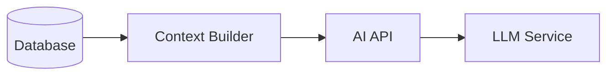

# AI Context Builder

The **Context Builder** is a specialized service designed to aggregate data from various system components and present it to the Large Language Model (LLM) in a structured, token-efficient format.

## Purpose

The LLM needs "situational awareness" to provide useful answers. While `DeviceMetrics` provide raw performance numbers, they lack the semantic context of *what* the system is doing (Jobs) and *what went wrong* (Errors). The Context Builder bridges this gap.

## Architecture

The Context Builder operates as a middleware between the raw database models and the AI's prompt construction.



## Integrated Data Sources

Currently, the Context Builder integrates the following data sources:

### 1. Job Outcomes (`JobOutcome`)
*   **Trigger:** Always fetched when analyzing a device, or on demand.
*   **Content:** Recent failed jobs (last 24 hours).
*   **Fields:** Job ID, Type, Status, Error Message, Duration.
*   **Goal:** Helps the AI understand if a device failure was caused by a specific operation (e.g., a failed firmware update).

### 2. Error Logs (`ErrorLog`)
*   **Trigger:** Always fetched when analyzing a device.
*   **Content:** Recent system errors associated with the device.
*   **Fields:** Timestamp, Severity, Category, Error Message.
*   **Goal:** Provides specific error codes and stack traces that the AI can use to diagnose root causes.

### 3. Configuration History (`ConfigurationHistory`)
*   **Trigger:** Always fetched when analyzing a device.
*   **Content:** Recent configuration changes (last 5 changes).
*   **Fields:** Timestamp, Parameter Name, Changed By, Change Type.
*   **Goal:** Allows the AI to correlate performance issues with recent configuration changes (e.g., "Latency increased after `max_connections` was changed").

### 4. Audit Logs (`AuditLog`)
*   **Trigger:** Always fetched when analyzing a device.
*   **Content:** Recent system events (last 5 logs).
*   **Fields:** Timestamp, Event Type, Description.
*   **Goal:** Provides a broader operational context (e.g., "User logged in", "System rebooted").

## Usage

The `ContextBuilder` is used within the `query_ai` endpoint in `ai/api.py`.

```python
# Example Usage
context_builder = ContextBuilder()

# Get context for a specific device
job_context = await context_builder.get_job_context()
error_context = await context_builder.get_error_context(device_id="device-123")
config_context = await context_builder.get_config_context(device_id="device-123")
audit_context = await context_builder.get_audit_context(device_id="device-123")
```

## Future Expansion

The following data sources are planned for integration:
*   `UserActivity`: For understanding user intent.
*   `PushNotificationLog`: For diagnosing delivery issues.
