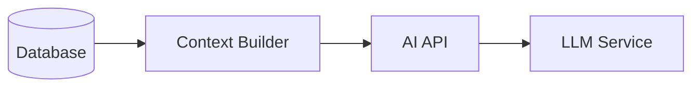

# AI Context Builder

The **Context Builder** is a specialized service designed to aggregate data from various system components and present it to the Large Language Model (LLM) in a structured, token-efficient format.

## Purpose

The LLM needs "situational awareness" to provide useful answers. While `DeviceMetrics` provide raw performance numbers, they lack the semantic context of *what* the system is doing (Jobs) and *what went wrong* (Errors). The Context Builder bridges this gap.

## Architecture

The Context Builder operates as a middleware between the raw database models and the AI's prompt construction.



## Performance Architecture

To ensure low latency while fetching data from 10+ sources, the Context Builder utilizes an **asynchronous parallel execution model**:

1.  **Concurrent Fetching:** All context methods are executed simultaneously using `asyncio.gather`. This reduces the total latency from the *sum* of all DB queries to the *maximum* of the slowest single query.
2.  **Session Reuse:** A single database session is shared across all context builders during a request, minimizing connection pool overhead.
3.  **ID Resolution Strategy:** The system employs a **Device Resolver** pattern to optimize query performance.
    *   **Problem:** The API receives public UUID strings, but high-volume tables (Audit Logs, Health Checks) use Integer Foreign Keys for performance.
    *   **Solution:** The `DeviceResolver` resolves the UUID to an Integer ID *once* at the start of the request. This Integer ID is passed to all Context Builder methods, enabling direct index lookups on the Foreign Key columns instead of expensive joins with the `Device` table.

## Integrated Data Sources

Currently, the Context Builder integrates the following data sources:

### 1. Job Outcomes (`JobOutcome`)
*   **Trigger:** Always fetched when analyzing a device, or on demand.
*   **Content:** Recent failed jobs (last 24 hours).
*   **Fields:** Job ID, Type, Status, Error Message, Duration.
*   **Goal:** Helps the AI understand if a device failure was caused by a specific operation (e.g., a failed firmware update).

### 2. Error Logs (`ErrorLog`)
*   **Trigger:** Always fetched when analyzing a device.
*   **Content:** Recent system errors associated with the device.
*   **Fields:** Timestamp, Severity, Category, Error Message.
*   **Goal:** Provides specific error codes and stack traces that the AI can use to diagnose root causes.

### 3. Configuration History (`ConfigurationHistory`)
*   **Trigger:** Always fetched when analyzing a device.
*   **Content:** Recent configuration changes (last 5 changes).
*   **Fields:** Timestamp, Parameter Name, Changed By, Change Type.
*   **Goal:** Allows the AI to correlate performance issues with recent configuration changes (e.g., "Latency increased after `max_connections` was changed").

### 4. Audit Logs (`AuditLog`)
*   **Trigger:** Always fetched when analyzing a device.
*   **Content:** Recent system events (last 5 logs).
*   **Fields:** Timestamp, Event Type, Description.
*   **Goal:** Provides a broader operational context (e.g., "User logged in", "System rebooted").

### 5. API Request Logs (`APIRequestLog`)
*   **Trigger:** Always fetched when analyzing a device.
*   **Content:** Recent failed API requests (status code >= 400).
*   **Fields:** Timestamp, Method, Endpoint, Status Code, Response Time.
*   **Goal:** Helps diagnose connectivity issues or backend failures (e.g., "500 Internal Server Error on /api/v1/sync").

### 6. Device State History (`DeviceStateHistory`)
*   **Trigger:** Always fetched when analyzing a device.
*   **Content:** Recent state transitions (e.g., Online -> Offline).
*   **Fields:** Timestamp, Previous State, New State, Reason.
*   **Goal:** Identifies stability issues like "flapping" (rapidly connecting/disconnecting).

### 7. Push Notification Logs (`PushNotificationLog`)
*   **Trigger:** Always fetched when analyzing a device.
*   **Content:** Recent push notification attempts.
*   **Fields:** Timestamp, Provider (FCM/APNs), Status (Sent/Failed), Error Message.
*   **Goal:** Diagnoses delivery issues (e.g., "Alert not received because token was invalid").

### 8. User Context (`User`, `UserActivity`)
*   **Trigger:** Fetched when a `user_id` is available in the query context.
*   **Content:** User profile (Role, Status) and recent actions.
*   **Fields:** Username, Role, Activity Type (e.g., `page_view`), Target URL.
*   **Goal:** Provides context on *who* is asking or *what* they were doing (e.g., "User 'admin' viewed the logs page").

### 9. Site Context (`SiteOperatingSchedule`)
*   **Trigger:** Always fetched when analyzing a device.
*   **Content:** Operating hours and current status (Open/Closed).
*   **Fields:** Site ID, Status, Open Time, Close Time.
*   **Goal:** Contextualizes "offline" alerts (e.g., "Device is offline, but the store is closed, so it's low priority").

### 10. Metadata Context (`Device`, `HealthCheck`)
*   **Trigger:** Always fetched when analyzing a device.
*   **Content:** Static device details and raw health pings.
*   **Fields:** Firmware Version, IP Address, Last Seen, Ping Latency.
*   **Goal:** Provides technical specs for correlation (e.g., "High latency on firmware v1.2.3").

### 11. System Knowledge (Self-Awareness)
*   **Trigger:** Always fetched.
*   **Content:** Project structure and high-level documentation.
*   **Fields:** Directory tree, README content.
*   **Goal:** Gives the AI awareness of the codebase it resides in (e.g., "I know this is the HOMEPOT project and the frontend is in `/frontend`").

### 12. Long-Term Memory (Vector Store)
*   **Trigger:** Always fetched.
*   **Content:** Semantically similar past events from ChromaDB.
*   **Fields:** Past analysis, resolutions, error patterns.
*   **Goal:** Provides historical wisdom (e.g., "This looks like the issue we solved last week by restarting the service").

## Usage

The `ContextBuilder` is used within the `query_ai` endpoint in `ai/api.py`.

```python
# Example Usage
context_builder = ContextBuilder()

# Get context for a specific device
job_context = await context_builder.get_job_context()
error_context = await context_builder.get_error_context(device_id="device-123")
config_context = await context_builder.get_config_context(device_id="device-123")
audit_context = await context_builder.get_audit_context(device_id="device-123")
api_context = await context_builder.get_api_context()
state_context = await context_builder.get_state_context(device_id="device-123")
push_context = await context_builder.get_push_context(device_id="device-123")
user_context = await context_builder.get_user_context(user_id="1")
site_context = await context_builder.get_site_context(device_id="device-123")
metadata_context = await context_builder.get_metadata_context(device_id="device-123")
```

## Future Expansion

All planned data sources have been integrated. Future work will focus on:
*   **Performance Optimization:** Caching context results to reduce DB load.
*   **Relevance Filtering:** Using vector search to only include *relevant* logs instead of just *recent* ones.

By providing comprehensive situational awareness, the Context Builder empowers the LLM to deliver accurate, context-rich responses for device diagnostics and troubleshooting.

