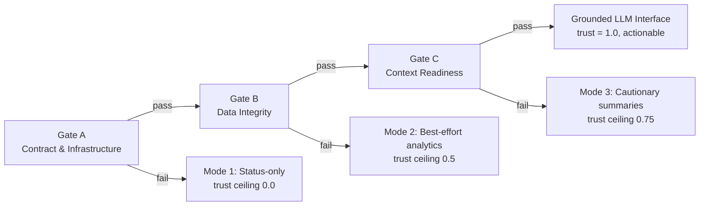

# Trust & Validation Gates

> **Status:** Implemented (July 2026)
> **Related:** [AI Implementation & Architecture](ai-implementation.md) &middot; [Context Builder](ai-context-builder.md) &middot; [Anomaly Detection](anomaly-detection.md)

The **System Diagnostics AI** does not treat every LLM answer as equally trustworthy. Before a question reaches the model, the underlying telemetry passes through a sequential chain of **validation gates** (Gate A &rarr; Gate B &rarr; Gate C &rarr; &hellip;). Each gate either passes or fails; a failure short-circuits the chain into a named, capped-trust **mode** instead of silently allowing an unqualified narrative. This is the implementation of the *validation-first* architecture described in the HOMEPOT ICCS2026 paper (Fig. 2).

The goal is simple: **a technician should never see a recommendation without also seeing how much confidence to place in it.**

## Why gate before generating?

An LLM will happily produce a fluent, confident-sounding answer even when the data behind it is stale, incomplete, or malformed. The validation envelope makes that risk visible and bounded:

* Each gate inspects a specific quality dimension of the data the LLM is about to be given.
* A failing gate doesn't necessarily block the chat turn -- the LLM still responds -- but the response is explicitly labeled as non-actionable/advisory, and the reported trust score is capped accordingly.
* The chain is **extensible**: new gates (e.g. a future cybersecurity/provenance Gate D) can be appended without modifying Gate A/B/C.

## The gate chain



### Gate A -- Contract and Infrastructure

Implemented in `ai/gates/gate_a.py`. Confirms the data-producing interfaces are stable and schema-conformant before anything else is trusted:

| Check | What it verifies |
|---|---|
| `A.api_schema_conformance` | The `device_metrics` / `health_checks` ORM/Pydantic columns actually match the live schema. |
| `A.db_readiness` | The core telemetry tables are queryable (row counts, TimescaleDB availability). |

Failing Gate A falls back to **Mode 1: Status-only** -- we can't even trust the shape of incoming data, so no LLM narrative/recommendation is permitted.

### Gate B -- Data Integrity

Implemented in `ai/gates/gate_b.py`. Confirms the telemetry itself is fit to reason over:

| Check | What it verifies |
|---|---|
| `B.completeness` | Non-null completeness across recent `device_metrics` rows. |
| `B.freshness` | Latest telemetry timestamp is within threshold (default 300s). |
| `B.continuity` | No excessive inter-arrival gap between health checks (default 60s). |
| `B.gap_checks` | No sustained discontinuities in telemetry (default 3600s). |
| `B.validity` | CPU/Memory/Disk values fall within a valid `[0, 100]` range. |

Failing Gate B falls back to **Mode 2: Best-effort analytics** -- the LLM may still analyze the data, but the result is marked limited-trust / not audit-ready.

### Gate C -- Context Readiness

Implemented in `ai/gates/gate_c.py`. Confirms the assembled prompt context handed to the LLM is well-formed:

| Check | What it verifies |
|---|---|
| `C.stable_content_blocks` | All required section headers are present in the assembled context. |
| `C.id_rules` | Every alert ID referenced in the context actually exists in the current status data (no dangling references). |
| `C.bounded_context` | The assembled context stays within a bounded size (default 16,000 chars). |

Failing Gate C falls back to **Mode 3: Cautionary summaries** -- only uncertainty-qualified, non-actionable summaries are permitted.

Gate C is deliberately **re-evaluated twice** per query: once against the base context, and again after the AI Insights block (anomaly/failure-prediction signals, see below) is appended -- since that append can push the context past the size threshold or otherwise disturb readiness. If the post-insight check fails, the trust mode is downgraded to Mode 3 even if the first pass was fully actionable.

### Grounded LLM Interface

If every gate in the chain passes, the envelope reports the **`grounded`** mode: full, actionable AI inference and recommendations, trust score up to `1.0`.

## Trust modes reference

| Mode | ID | Actionable? | Trust ceiling | Meaning |
|---|---|---|---|---|
| Mode 1: Status-only | `mode_1` | No | `0.0` | Raw status may be reported; no LLM narrative permitted. |
| Mode 2: Best-effort analytics | `mode_2` | No | `0.5` | LLM analysis permitted but explicitly limited-trust. |
| Mode 3: Cautionary summaries | `mode_3` | No | `0.75` | Only non-actionable, uncertainty-qualified summaries. |
| Grounded LLM Interface | `grounded` | Yes | `1.0` | All gates passed -- full grounded inference. |

!!! note "Tunable, not yet calibrated"
    The trust-ceiling values and per-gate weights are the paper's initial defaults (`ai/gates/base.py`, `ai/gates/envelope.py`) and are explicitly marked `TUNABLE` in code -- they have not yet been empirically calibrated against real deployment data (paper Sec. 6). Adjusting a `Mode.trust_ceiling` or a `Gate.weight` is a one-line change; no other code needs to change.

## AI Insights are gated on Gate B

The chat response also surfaces the same anomaly-detection and failure-prediction signals a technician would see elsewhere in the product (see [Anomaly Detection](anomaly-detection.md)) -- but **only when Gate B (data integrity) has passed**. Anomaly scores and failure predictions are themselves derived from the same telemetry Gate B validates, so computing and presenting them on data that has already failed integrity checks would hand the LLM a confident-looking conclusion built on data known not to be trustworthy. When Gate B fails, the AI Insights section is replaced with an explicit skip note instead.

## API response shape

`POST /api/v1/ai/query` (implemented in `backend/src/homepot/app/api/API_v1/Endpoints/AIEndpoint.py`) returns the validation envelope's result alongside the answer:

```jsonc
{
  "response": "The current system status is as follows: ...",
  "timestamp": "2026-07-17T15:13:16.418238",
  "trust": {
    "trust_mode": "grounded",
    "trust_mode_label": "Grounded LLM Interface",
    "trust_score": 1.0,
    "actionable": true,
    "passed_gates": ["A", "B", "C", "C"],
    "failed_gate": null,
    "summary": "Passed all gates (A, B, C, C) \u2014 Grounded LLM Interface",
    "gates": [
      {
        "gate_id": "A",
        "name": "Contract and Infrastructure",
        "status": "pass",
        "score": 1.0,
        "checks": [ { "check_id": "A.db_readiness", "passed": true, "message": "...", "evidence": [ /* traceable table/row refs */ ] } ]
      }
      // ...B, C (pre-insight), C (post-insight)
    ]
  }
}
```

Every check carries `evidence` entries (table, field, record ID, observed value, threshold) so a trust label or finding can always be traced back to the specific data that produced it -- see `EnvelopeResult.trace()` in `ai/gates/envelope.py`.

## Dashboard presentation

The **System Diagnostics AI** widget (`frontend/src/components/Dashboard/AskAIWidget.jsx`) renders a **trust banner** above every recommendation, so the gate outcome is never hidden behind the answer text:

* A color-coded icon + label for the resulting trust mode (green for `grounded`, amber/orange/red for the degraded modes).
* De-duplicated gate chips (`A`, `B`, `C`) -- green if that gate passed, red if it's the one that failed.
* An overall **Trust %** score.
* A click-to-expand detail view listing every gate's individual check messages (row counts, freshness, completeness, etc.), including both the pre- and post-insight Gate C re-validation.

 *(illustrative -- see the live widget for the actual component)*

## Extending the chain

New gates can be appended to the envelope without touching Gate A/B/C:

```python
from ai.gates.envelope import build_default_envelope

envelope = build_default_envelope()
envelope.add_gate(MyCybersecurityGate())  # e.g. a future Gate D
```

Each gate defines its own `failure_mode` (a `Mode` instance), so a new gate can introduce its own fallback trust mode independently of the existing ones.

## Testing

The full gate chain, individual gate checks, and trust-mode fallbacks are covered in `backend/tests/test_validation_gates.py`.

```bash
cd backend
python -m pytest tests/test_validation_gates.py -v --no-cov
```
