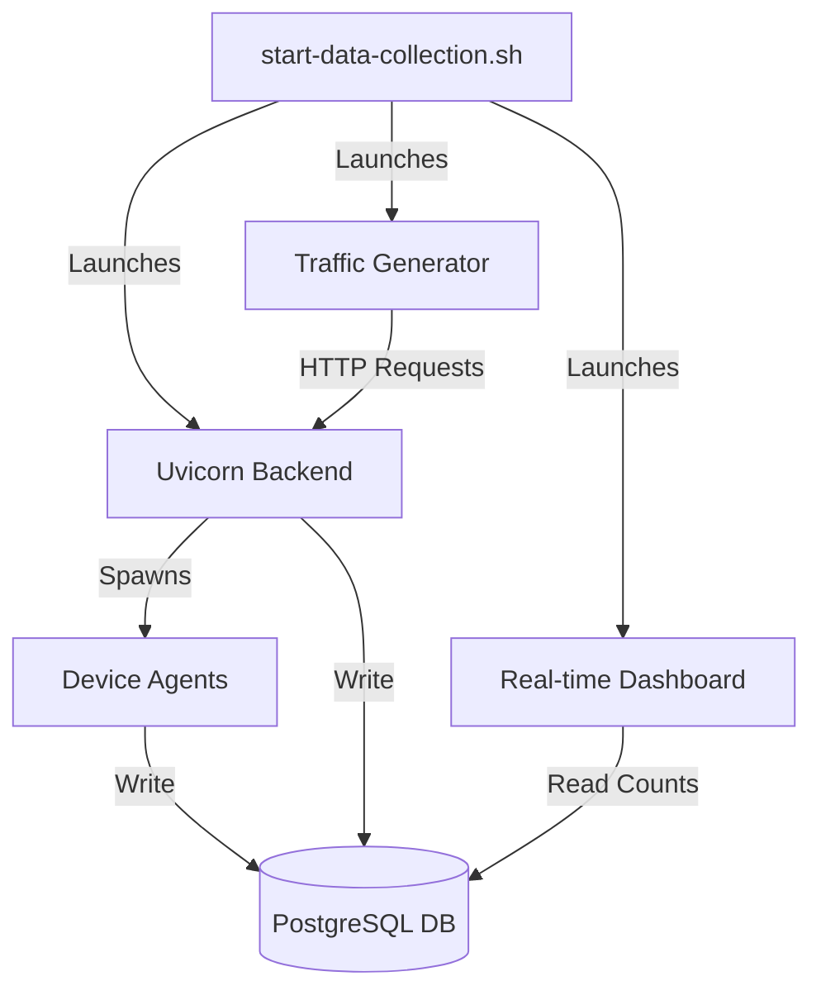

# Data Collection Suite Reference

This document provides a technical reference for the Data Collection Suite, a set of tools designed to generate high-quality training data for HOMEPOT's AI models.

## Overview

The Data Collection Suite automates the generation of synthetic data across all layers of the application:
- **Device Layer:** Simulated POS terminals generating hardware metrics.
- **Network Layer:** API request logs and latency metrics.
- **Application Layer:** User activity, job processing, and error logging.
- **Business Layer:** Configuration changes and operational outcomes.

## Components

### 1. Orchestrator (`start-data-collection.sh`)

The entry point for the suite. It manages the lifecycle of all other components.

**Functions:**
- Checks prerequisites (Python, Virtual Env, Database).
- Validates database connectivity.
- Starts the Backend Server (`uvicorn`) in the background.
- Launches the Traffic Generator (`generate_traffic.py`).
- Starts the Real-time Dashboard (`visualize_progress.py`).
- Handles graceful shutdown (traps SIGINT/SIGTERM) to kill all background processes.

### 2. Traffic Generator (`backend/utils/generate_traffic.py`)

A sophisticated script that simulates realistic user and system behavior. It runs concurrently with the backend.

**Simulation Capabilities:**
- **Authentication:** Automatically handles Admin login or falls back to Simulation User registration/login.
- **User Activity:** Simulates page views, clicks, and searches (for `user_activities` table).
- **Job Creation:** Randomly creates jobs for sites (e.g., "Update POS payment config"), triggering `job_outcomes`.
- **Error Injection:** Randomly injects errors (API timeouts, validation errors) to populate `error_logs`.
- **Device Interaction:** Simulates Push Notification acknowledgments and device queries.
- **Site Management:** Creates new sites and devices if none exist.

**Key Metrics Generated:**
- `User Activity` (Rate: ~15/min)
- `Job Outcomes` (Rate: ~5/min)
- `Error Logs` (Rate: ~1/min)
- `Config History` (Triggered by job creation)

### 3. Real-time Dashboard (`backend/utils/visualize_progress.py`)

A terminal-based UI built with the `rich` library that provides immediate feedback on data collection progress.

**Features:**
- **Live Statistics:** Displays total counts for all 6 key metrics.
- **Session Tracking:** Shows how many new records were added in the current session.
- **Rate Calculation:** Calculates and displays the generation rate (records per minute) for all metrics.
- **Log Stream:** Shows the latest application log entry in real-time.

**Metrics Tracked:**
1. **Device Metrics:** CPU, RAM, Disk usage from agents.
2. **API Request Logs:** HTTP traffic logs.
3. **Error Logs:** Application exceptions and injected errors.
4. **User Activity:** Frontend interaction logs.
5. **Job Outcomes:** Success/Failure status of background jobs.
6. **Config History:** Audit trail of system changes.

### 4. Device Agents (`backend/src/homepot/agents.py`)

The core device simulation logic embedded in the backend.

**Enhancements:**
- **High-Frequency Polling:** Health check and metric collection interval reduced from 30s to **5s**.
- **Scalability:** Spawns 10+ independent agent threads.
- **Realism:** Generates variable CPU/Memory usage patterns.

## Architecture



## Usage

To start the full suite:

```bash
./scripts/start-data-collection.sh
```

To validate the collected data quality:

```bash
python backend/utils/validate_data_collection.py --min-days 1
```
