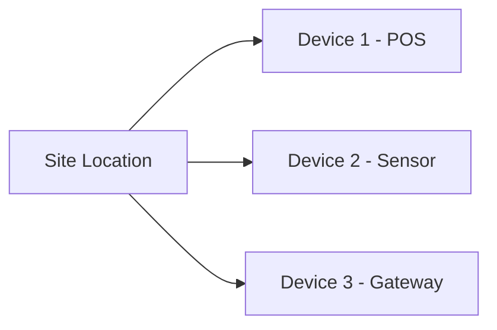

# Device Registration Guide

This guide explains how to register new devices in the HOMEPOT Client system. Device registration is a fundamental step in managing your OT (Operational Technology) and IoT assets.

## Conceptual Model

In HOMEPOT, every device must belong to a **Site**. This hierarchy ensures that devices are organized by their physical or logical location, enabling features like:

*   **Geospatial Visualization**: Viewing sites and their status on a world map.
*   **Group Management**: Applying policies or commands to all devices at a specific site.
*   **Access Control**: Restricting user access to specific sites.



## Prerequisites

Before registering a device, you must have at least one **Site** created in the system.

## Step 1: Create a Site

If you haven't created a site yet, follow these steps:

1.  Navigate to the **Sites** section in the dashboard.
2.  Click **Create New Site**.
3.  Fill in the required information:
    *   **Site Name**: A descriptive name (e.g., "London HQ").
    *   **Site ID**: A unique identifier (e.g., "site-lon-001").
    *   **Location**: A human-readable address (e.g., "London, UK").
    *   **Latitude & Longitude**: The GPS coordinates of the site. This is **crucial** for the world map visualization.
        *   *Example*: Latitude `51.5074`, Longitude `-0.1278` for London.
4.  Click **Create Site**.

## Step 2: Register a Device

Once you have a site, device registration can happen through two distinct methods, depending on your deployment strategy.

### Method A: Pre-Provisioned (Dashboard-Driven)
**Best for:** High-security environments, headless servers, or corporate-owned POS terminals.
In this method, the IT Admin creates the device placeholder in the dashboard first.

1. Navigate to the **Devices** section in the Admin Dashboard.
2. Click **Register New Device** (or navigate to `/device/new`).
3. **Assign to Site**: Select the site where this device is located from the dropdown menu.
4. **Device Details**: Provide a friendly Device Name and a unique Device ID (e.g., Serial Number or Asset Tag).
5. **Network & Info** (Optional): Provide IP Address, MAC Address, etc.
6. Click **Register Device**. The system logs this with `enrollment_method: pre-provisioned`.
7. When the HOMEPOT User App installed on the device boots, it will use this provisioning info to claim the pre-registered slot.

### Method B: Self-Enrolled (User App-Driven)
**Best for:** BYOD (Bring Your Own Device) instances like employee laptops or mobile phones.
In this method, the IT Admin only creates the Site. The hardware registers itself dynamically.

1. The IT Admin shares the **Site ID** with the end-user.
2. The user downloads the **HOMEPOT User App** to their device.
3. In the Setup Wizard, the user enters the Site ID and their Device Name (e.g., 'John-Laptop').
4. The user completes the SSO Login.
5. The User App automatically calls the API to create its own device record mapped to the Site. The dashboard logs this with `enrollment_method: self-enrolled`.

## API Reference

For developers integrating directly with the API:

### Create Site
`POST /api/v1/sites`

```json
{
  "site_id": "site-001",
  "name": "New York Office",
  "location": "New York, USA",
  "latitude": 40.7128,
  "longitude": -74.0060
}
```

### Register Device
`POST /api/v1/devices/sites/{site_id}/devices`

```json
{
  "device_id": "dev-001",
  "name": "Lobby Sensor",
  "device_type": "iot_sensor",
  "site_id": "site-001",
  "ip_address": "192.168.1.50",
  "enrollment_method": "pre-provisioned"
}
```
