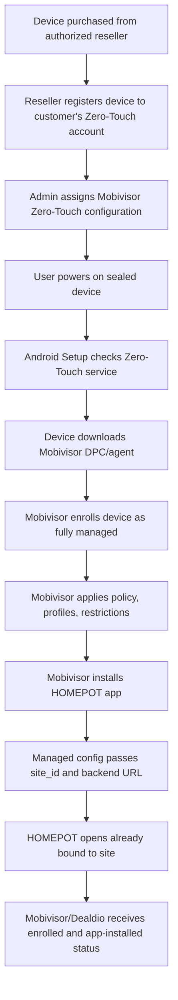
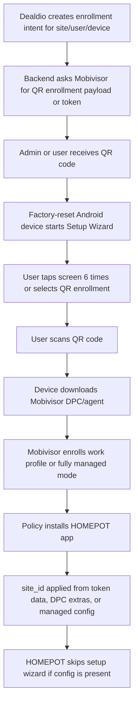
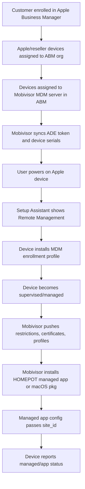
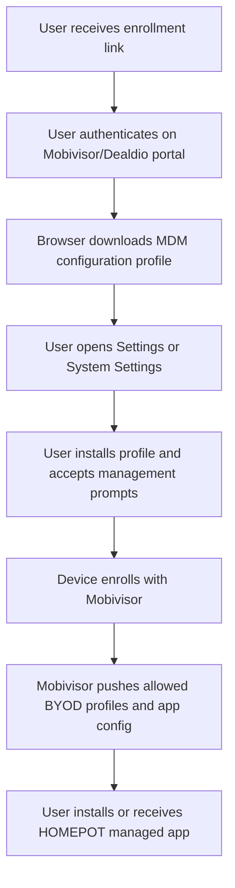
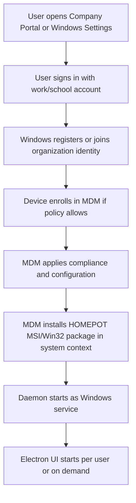

# Mobile & Desktop Enrollment Strategies

Prepared for: Dealdio Engineering Team  
Partner context: Mobivisor MDM / HOMEPOT User App deployment  
Date: 2026-05-08

## Executive Summary

The feasible deployment model is a hybrid:

1. Use Mobivisor as the MDM control plane for enrollment, profiles, managed app install, and policy compliance.
2. Use platform-native automated enrollment where device procurement supports it:
   - Android Zero-Touch for eligible Android devices bought through authorized resellers.
   - Apple Automated Device Enrollment (ADE / former DEP) for Apple devices assigned through Apple Business Manager.
   - Windows Autopilot or automatic MDM enrollment where customer tenants support Microsoft Entra / Intune-style enrollment. If Mobivisor supports Windows MDM, align to its equivalent enrollment workflow.
3. Use manual fallback enrollment for BYOD / legacy devices:
   - Android QR enrollment or enrollment-token link.
   - iOS / iPadOS / macOS manual MDM profile download and install.
   - Windows "Access work or school" / Company Portal-style enrollment, or a signed standalone installer for non-MDM machines.
4. Deploy HOMEPOT app configuration with managed app configuration rather than relying on the user to type Site ID. For Android QR enrollment, Site ID can be carried in enrollment token metadata or DPC/admin extras if Mobivisor exposes that mapping. For iOS and macOS, Site ID should be delivered via managed app configuration/profile payload or a bootstrap config installed by the package.

Mobivisor public materials confirm support for Android Zero Touch, Samsung Knox Mobile Enrollment, Apple DEP/VPP, app catalog installation, direct app install/deinstall, policies, profiles, in-app configuration, and automatic application of policies/apps at registration. Public Mobivisor API documentation was not found, so Dealdio must request their partner API contract for exact endpoint names, auth, payload shape, rate limits, callback/webhook behavior, and device/app status semantics.

## Hard Prerequisites

### Cross-Platform

- Mobivisor tenant configured for the customer/consortium, with API credentials if Dealdio backend will automate enrollment setup.
- Stable HOMEPOT device identity model:
  - `site_id`
  - `tenant_id`
  - optional `device_assignment_id`
  - expected ownership mode: corporate-owned, COPE, BYOD, kiosk/dedicated.
- HOMEPOT User App package identifiers:
  - Android package name.
  - iOS/macOS bundle ID.
  - Windows app/product code if MSI.
- App distribution path:
  - Public store, private/managed store, enterprise distribution, or direct binary/package hosted by Mobivisor.
- A managed configuration schema in the HOMEPOT app so MDM can pass `site_id` and environment values silently.
- A device status callback path from Mobivisor to Dealdio, or a polling integration, so backend can mark onboarding as pending/enrolled/app-installed/configured.

### Android Zero-Touch

Hard requirements:

- Eligible Android device:
  - Android 9+ generally, compatible Android 8.0 devices, or Pixel Android 7.0+.
  - Google Mobile Services and Google Play services enabled.
  - Purchased from an authorized Zero-Touch reseller who creates/links the zero-touch customer account.
- Enterprise Mobility Management provider that supports company-owned / fully managed devices. Mobivisor says it supports Android Enterprise and Google Zero Touch.
- Zero-Touch portal access using a corporate Google Account, not a personal Gmail account.
- Zero-Touch configuration selecting Mobivisor's DPC/agent and DPC extras.
- HOMEPOT User App must be approved/distributable for managed install:
  - Managed Google Play private app or public Play app is the cleanest route.
  - For enrollment-time management, Android only permits approved DPCs during provisioning; arbitrary non-DPC app installs are policy-driven after the device is managed.

Silent installation strategy:

- The zero-touch configuration installs the Mobivisor DPC/agent during provisioning.
- Mobivisor then applies the Android Enterprise policy that includes HOMEPOT User App:
  - `installType: FORCE_INSTALLED` for normal required deployment.
  - `installType: REQUIRED_FOR_SETUP` if setup must fail unless the app installs successfully.
- Use `managedConfiguration` for the app to pass `site_id`, backend URL, and feature flags.

### Apple ADE / DEP

Hard requirements:

- Apple Business Manager (ABM) or Apple School Manager enrollment. For commercial deployment, ABM is expected.
- Organization verification with Apple. A D-U-N-S number is commonly needed for Apple Business Manager enrollment and legal entity verification.
- Eligible Apple devices:
  - iPhone/iPad/iPod touch, Mac, Apple TV, Vision/Watch depending on platform support.
  - Purchased from Apple, a participating Apple Authorized Reseller, or carrier; non-channel devices can be added manually with Apple Configurator, with limitations and user-visible steps.
- Apple Customer Number or reseller/carrier Reseller ID linked in ABM.
- Mobivisor added as an MDM server in ABM.
- ADE server token (`.p7m`) generated in ABM and uploaded to Mobivisor. This token generally requires annual renewal.
- Apple Push Notification service (APNs) certificate for the MDM server/tenant, also renewable.
- Volume Purchase / Apps and Books setup if HOMEPOT iOS app is App Store, Custom App, or private business app distributed as a managed app.
- For silent-ish app installation:
  - Supervised device is strongly preferred.
  - Device-assigned app licenses avoid Apple ID prompts.
  - Managed app configuration is used to inject `site_id`.

Constraints:

- ADE enrolls devices into MDM during Setup Assistant. It is the best "out-of-box" Apple path.
- BYOD/manual profile enrollment can install management, but user approval is required and management scope is narrower than supervised ADE.
- iOS app installs may still show prompts in some contexts unless the device is supervised and licensing/configuration are correct.

### Windows

Hard requirements for MDM-based route:

- Windows 10/11 supported edition. As of 2026, Windows 10 is past end of support but can still enroll in Intune-like systems with reduced assurance.
- Customer identity/enrollment stack:
  - Microsoft Entra ID / Autopilot / Intune if using Microsoft stack.
  - Or Mobivisor's Windows enrollment equivalent if available.
- Silent installer package:
  - Prefer signed MSI or signed EXE with documented silent switches.
  - If using Intune-style Win32 deployment, package as `.intunewin`.
- Install behavior set to system/device context for background daemon/root service.
- Detection rules and uninstall command for lifecycle management.
- Code signing certificate for Windows binaries and installer.

### macOS

Hard requirements:

- MDM enrollment through ADE or manual profile.
- Signed and notarized `.pkg` for daemon + Electron UI.
- Apple Developer ID Installer certificate for package signing.
- LaunchDaemon / privileged helper design reviewed for least privilege.
- For MDM package install, package signature must be verifiable by the Mac.
- For modern macOS, prefer MDM-managed Login Items / Background Items / System Extension profiles where applicable.

## Enrollment Flows

### Android Zero-Touch: Corporate-Owned

End-user experience:

- User turns on device.
- Connects to Wi-Fi or uses cellular if provisioning allows it.
- Sees corporate/MDM management disclosure.
- Device completes setup and installs required apps.
- HOMEPOT User App appears and should open without Page 1 Site ID setup.

### Android Manual QR: BYOD / Legacy / Non-Zero-Touch

Can Site ID be embedded?

Yes, technically. The recommended implementation depends on Mobivisor:

- If Mobivisor exposes Android Management API-style enrollment tokens, use token `additionalData` for `site_id` or a Dealdio enrollment reference. Google documents this as arbitrary data exposed on the enrolled device resource.
- If Mobivisor exposes DPC/admin extras, include a vendor-defined JSON bundle. Android passes admin extras to the DPC; Mobivisor must then map those extras into managed app configuration for HOMEPOT.
- If Mobivisor only supports static QR templates, encode a short Dealdio enrollment code in a URL or post-enrollment API association, then have HOMEPOT claim it after first launch.

Do not put long-lived secrets in the QR payload. Use one-time enrollment IDs with expiry.

### Apple ADE: Corporate-Owned

End-user experience:

- User powers on device.
- Setup Assistant shows Remote Management for the organization.
- User signs in if the profile requires authentication.
- MDM enrollment occurs during setup.
- Required app and profiles arrive after enrollment.

### Apple Manual Profile: BYOD / Legacy

User-facing constraints:

- iOS/iPadOS profile downloads require the user to go to Settings and install the profile.
- Apple says a downloaded profile must be installed within 8 minutes or it is automatically deleted.
- Manual enrollment cannot be treated as frictionless or fully silent.
- User-approved MDM and supervision limitations affect what can be enforced, especially on personal devices.

### Windows Manual / Automatic Enrollment

For non-MDM Windows devices:

- Provide a signed bootstrap installer from Dealdio/Mobivisor portal.
- Installer runs with admin elevation.
- It installs:
  - Windows service/root daemon.
  - Electron UI.
  - machine config containing a one-time enrollment code.
- The daemon calls Dealdio backend to exchange the one-time code for device credentials.

## Desktop Installer / Daemon Provisioning

### Windows Recommended Package

- Build signed MSI for HOMEPOT daemon + Electron UI.
- Install daemon as Windows Service under LocalSystem or a least-privilege service account.
- Install UI per-machine under `Program Files`.
- Silent install command examples:
  - MSI: `msiexec /i Homepot.msi /qn SITE_ID=<id> ENROLLMENT_TOKEN=<one-time-token>`
  - EXE: `HomepotSetup.exe /quiet /norestart /siteId <id> /enrollmentToken <token>`
- For Intune-like MDM, deploy as required Win32 app in system context. Microsoft notes Intune Win32 apps must install silently and cannot require user interaction.
- Detection rule:
  - MSI product code, service presence, or installed file version.
- Post-install:
  - daemon starts immediately.
  - daemon registers with Dealdio.
  - UI can be launched at login via approved startup mechanism.

Security note: avoid placing raw long-lived secrets in install command lines because command-line arguments can be logged. Prefer a short-lived bootstrap token, or have the package pull assignment from Mobivisor/Dealdio using device identity after MDM enrollment.

### macOS Recommended Package

- Build signed and notarized `.pkg`.
- Include:
  - `LaunchDaemon` for privileged/root background work.
  - Electron app in `/Applications`.
  - optional LaunchAgent/Login Item for user UI.
  - profiles for permissions where MDM supports pre-approval, such as PPPC, System Extensions, Network Extensions, Login Items, certificates, and VPN.
- Deploy via MDM as:
  - declarative package management where supported, or
  - Apple `InstallEnterpriseApplication` / package install path on managed Macs.
- Apple requires package signatures verifiable by the device for MDM package distribution.

macOS caveats:

- Some privacy permissions cannot be granted silently without MDM PPPC profiles.
- User notifications, screen recording, accessibility, and endpoint/security extension permissions need explicit profile planning.
- Apple Silicon may require system extension and network extension approvals through MDM.

## API Touchpoints for Dealdio Backend

The exact endpoints must come from Mobivisor. The backend integration should be designed around these logical operations:

### 1. Tenant / Site Bootstrap

Purpose: connect a Dealdio site to Mobivisor enrollment assets.

Likely Mobivisor operation:

- Create or select organization/customer.
- Create device group per HOMEPOT site.
- Create base policy/profile set.
- Upload/import app package or reference managed store app.
- Define managed app configuration template with `site_id`.

Dealdio data stored:

- `mobivisor_tenant_id`
- `mobivisor_group_id`
- `mobivisor_policy_id`
- `homopot_app_catalog_id`
- app config template revision

### 2. Automated Enrollment Assignment

Android Zero-Touch:

- Dealdio probably should not call Google Zero-Touch directly unless Mobivisor delegates that responsibility.
- Preferred: call Mobivisor API to assign a Zero-Touch configuration or Mobivisor device group/policy to known serial/IMEI/device IDs after reseller import.
- Required payload fields:
  - device identifier(s)
  - target group/policy
  - site assignment
  - DPC extras or managed config reference

Apple ADE:

- Dealdio should not own the ABM token if Mobivisor is MDM of record.
- Preferred: call Mobivisor API after Mobivisor syncs ADE devices to assign serial numbers to group/profile.
- Required payload fields:
  - Apple serial number
  - Mobivisor ADE profile
  - group/policy
  - managed app configuration with `site_id`

### 3. Manual Enrollment Link / QR Generation

Android QR:

- Backend requests a one-time enrollment token or QR payload from Mobivisor.
- Include Dealdio `site_id` or a Dealdio `enrollment_intent_id`.
- Response should include QR JSON, QR image URL, or token value.

iOS/macOS/Windows web enrollment:

- Backend creates a Dealdio enrollment intent.
- User authenticates in Dealdio/Mobivisor portal.
- Portal redirects to Mobivisor enrollment URL/profile flow.
- Mobivisor enrolls the device and returns enrollment status through callback or polling.

### 4. App Install Trigger

For already enrolled devices:

- Call Mobivisor to assign HOMEPOT app to device/group as required.
- Call Mobivisor to push/update managed app configuration.
- Optionally issue device sync/check-in command.
- Track install state:
  - queued
  - acknowledged
  - installing
  - installed
  - failed/non-compliant

Platform-specific:

- Android: policy `applications[]` with package name, `installType`, permissions, managed config.
- Apple: managed app assignment / `InstallApplication`, VPP license assignment, managed app config.
- macOS: package deployment / `InstallEnterpriseApplication` or declarative package config.
- Windows: app assignment to device/group with silent install command and detection rules.

### 5. Status / Compliance Callback

Required events:

- enrollment token created
- device enrolled
- device assigned to site
- profile applied
- HOMEPOT app installed
- HOMEPOT managed config applied
- daemon registered with Dealdio
- installation failed / non-compliant
- device wiped / retired / unenrolled

Recommended Dealdio endpoint:

- `POST /integrations/mobivisor/events`

Minimum event fields:

- `event_id`
- `event_type`
- `mobivisor_device_id`
- `platform`
- `serial` / `imei` / `udid` where legally and technically available
- `site_id` or `enrollment_intent_id`
- `status`
- `timestamp`
- `error_code`
- `raw_payload_ref`

## Recommended Decision Matrix

| Device type | Best path | Fallback | Silent app/config feasibility |
| --- | --- | --- | --- |
| Corporate Android, reseller eligible | Zero-Touch + Mobivisor policy | QR provisioning | High after DPC enrollment |
| Android BYOD | Work profile enrollment link/QR | User installs app + signs in | Medium; depends on work profile and MDM scope |
| Corporate iPhone/iPad | ABM ADE + supervised managed app | Apple Configurator-added ADE or manual profile | High if supervised + device app license |
| iOS BYOD | Manual User Enrollment / MDM profile | App Store install + login/deep link | Low to medium; user action required |
| Corporate Mac | ABM ADE + signed pkg + profiles | Manual MDM profile + pkg | High for package/profile install after MDM |
| BYOD Mac | Manual profile or signed installer | User-run installer | Medium; permissions may require prompts |
| Corporate Windows | Autopilot/MDM + MSI/Win32 app | Signed bootstrap installer | High if MDM enrolled |
| BYOD Windows | Company Portal/Access work or school | User-run signed installer | Medium; admin rights may be required |

## Open Questions for Mobivisor

1. Is there a public or partner REST API for device group assignment, app assignment, profile assignment, and command execution?
2. Does Mobivisor expose Android Zero-Touch customer API configuration management, or only portal/manual setup?
3. Can DPC extras from Zero-Touch / QR enrollment be mapped automatically into managed app configuration for a target app?
4. Does Mobivisor support one-time enrollment links/tokens with arbitrary metadata?
5. What app distribution modes are supported for HOMEPOT Android: Managed Google Play private app, direct APK, or both?
6. What app distribution modes are supported for iOS: App Store, Custom App through ABM, proprietary in-house app, or all?
7. Does Mobivisor support Windows and macOS package deployment natively, including MSI/PKG silent install and status reporting?
8. What webhooks are available for device enrollment/app install/profile compliance?
9. Can Mobivisor push managed app configuration updates after install, and how is success/failure reported?
10. What identifiers can Mobivisor legally/technically share back to Dealdio per platform?

## Sources

- Android Zero-Touch prerequisites and flow: https://support.google.com/work/android/answer/7514005
- Android Enterprise enrollment options: https://www.android.com/enterprise/enrollment/
- Android Management API enrollment tokens and QR payload: https://developers.google.com/android/management/reference/rest/v1/enterprises.enrollmentTokens
- Android Management API policy/app install and managed configuration fields: https://developers.google.com/android/management/reference/rest/v1/enterprises.policies
- Android managed configurations: https://developer.android.com/work/managed-configurations
- Apple Automated Device Enrollment overview and requirements: https://support.apple.com/102300
- Apple MDM profile deployment: https://developer.apple.com/documentation/devicemanagement/deploying-mdm-enrollment-profiles
- Apple iOS/iPadOS profile install user flow: https://support.apple.com/102400
- Apple InstallApplication MDM command: https://developer.apple.com/documentation/devicemanagement/install-application-command
- Apple managed app distribution: https://support.apple.com/guide/deployment/distribute-managed-apps-dep575bfed86/web
- Apple macOS package distribution by MDM: https://support.apple.com/guide/deployment/dep873c25ac4/web
- Microsoft Intune Win32 app silent deployment model: https://learn.microsoft.com/en-us/intune/app-management/deployment/add-win32
- Microsoft Windows enrollment user flow: https://learn.microsoft.com/en-us/intune/user-help/enrollment/enroll-windows
- Microsoft Windows enrollment options: https://learn.microsoft.com/en-us/intune/device-enrollment/windows/guide
- Mobivisor public feature page: https://www.mobivisor.de/en/features/management/
- Mobivisor support/automatic configuration page: https://www.mobivisor.de/en/features/support/
- Mobivisor iOS app enrollment description: https://apps.apple.com/us/app/mobivisor/id909281534
