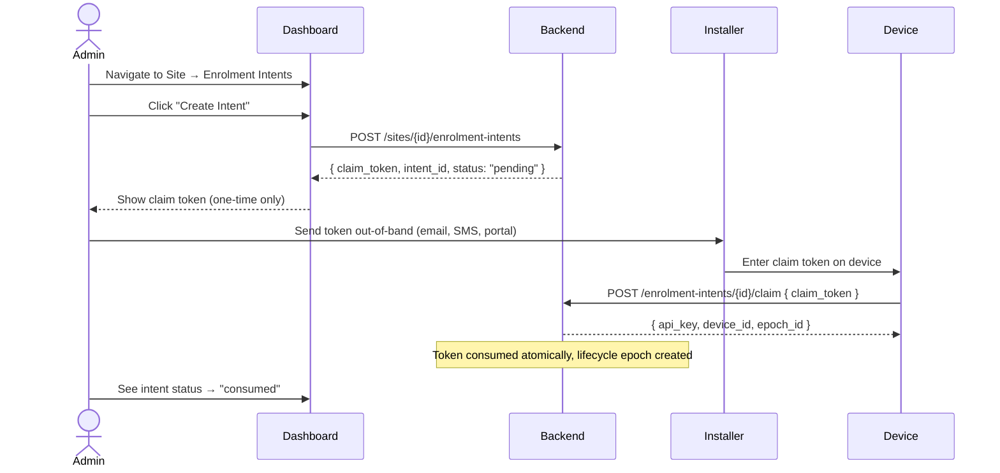

# Enrolment Intents

Pre-provisioned enrolment intents allow an administrator to create a pending device slot for a site, generate a one-time claim token, and hand that token off to an installer. The installer's User App or agent submits the token to complete the enrolment — the administrator never needs to be physically present at the device.

## Workflow



## API Endpoints

All endpoints require authentication. The `POST` and `PUT` endpoints require `operator`-level access on the target site.

| Method | Path | Description |
|--------|------|-------------|
| `POST` | `/api/v1/sites/{site_id}/enrolment-intents` | Create a new enrolment intent |
| `GET` | `/api/v1/sites/{site_id}/enrolment-intents` | List intents for a site (supports `?status=` filter) |
| `GET` | `/api/v1/sites/{site_id}/enrolment-intents/{intent_id}` | Get intent details |
| `PUT` | `/api/v1/sites/{site_id}/enrolment-intents/{intent_id}` | Update intent status (`approved`, `rejected`, `revoked`) |
| `POST` | `/api/v1/sites/{site_id}/enrolment-intents/{intent_id}/regenerate-token` | Generate a new claim token, invalidating the old one |
| `POST` | `/api/v1/enrolment-intents/{intent_id}/claim` | Claim a device via its one-time token (unauthenticated) |

## Intent Statuses

| Status | Meaning |
|--------|---------|
| `pending` | Intent created, no token action taken yet |
| `approved` | Token activated and ready for the installer to claim |
| `rejected` | Intent discarded by the administrator |
| `consumed` | Token was successfully claimed by a device |
| `expired` | The `expires_at` time has passed |
| `revoked` | Administrator cancelled the intent |

## Frontend

The Enrolment Intents page is at `/sites/{site_id}/enrolment-intents`.

### Layout

- **Header**: "Back to Site" button, title, "Create Intent" button
- **Stats cards**: 5 cards showing counts by status category (Active, Consumed, Expired, Revoked, Rejected)
- **Status filter**: Dropdown to filter the table
- **Table**: Columns — Intent ID (UUID), Status (coloured badge), Expires, Device Identity, Created, Actions

### Actions per row

| Button | Visible when | Effect |
|--------|-------------|--------|
| **Approve** | `pending` | Transitions to `approved` — token becomes claimable |
| **Reject** | `pending` | Transitions to `rejected` — intent discarded |
| **Regen Token** | `pending` or `approved` | Generates a new claim token, old one invalidated |
| **Revoke** | `pending` or `approved` | Transitions to `revoked` — intent cancelled |

### Creating an intent

1. Click **Create Intent** to show the form
2. Fill in optional fields:
   - **Expected Device Identity** — e.g. serial number or hardware ID
   - **Expires In (hours)** — default 48, max 8760
   - **Idempotency Key** — for safe retries
3. Click **Create Intent**
4. The one-time **claim token** appears in a yellow card with the warning "It will not be shown again"
5. The intents list refreshes automatically showing the new `pending` row

### Important notes

- The claim token is only visible **at creation time** and **at regeneration time**.
- The backend stores only a bcrypt hash of the token — the plaintext cannot be recovered.
- Expired intents are marked with red text and an "Expired" label in the table.
- Status transitions are only allowed from `pending` (backend enforces this).

## Testing

A dedicated backend test file covers the full lifecycle:

```bash
cd backend
python -m pytest tests/test_enrolment_intents.py -v
```

13 tests covering:
- Creating intents with and without optional fields
- Authentication and authorisation checks (401/403/404)
- Listing and filtering by status
- Status transitions: approve, reject, revoke
- Rejecting invalid transitions (e.g. approved → revoked returns 400)
- Token regeneration returns a new, different token
- GET endpoint returns full details without exposing `claim_token_hash`

## Related

- [Device Lifecycle & Ownership](device-lifecycle-and-ownership.md) — canonical lifecycle contract
- `frontend/src/pages/EnrolmentIntents/EnrolmentIntentsList.jsx` — React component
- `backend/src/homepot/app/api/API_v1/Endpoints/EnrolmentIntentsEndpoint.py` — API implementation
- `backend/tests/test_enrolment_intents.py` — test suite
