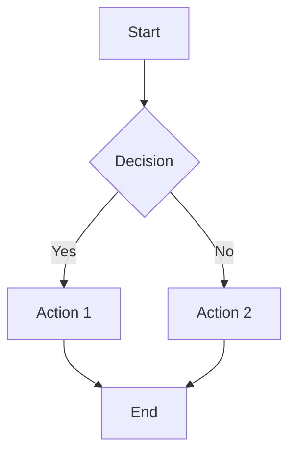
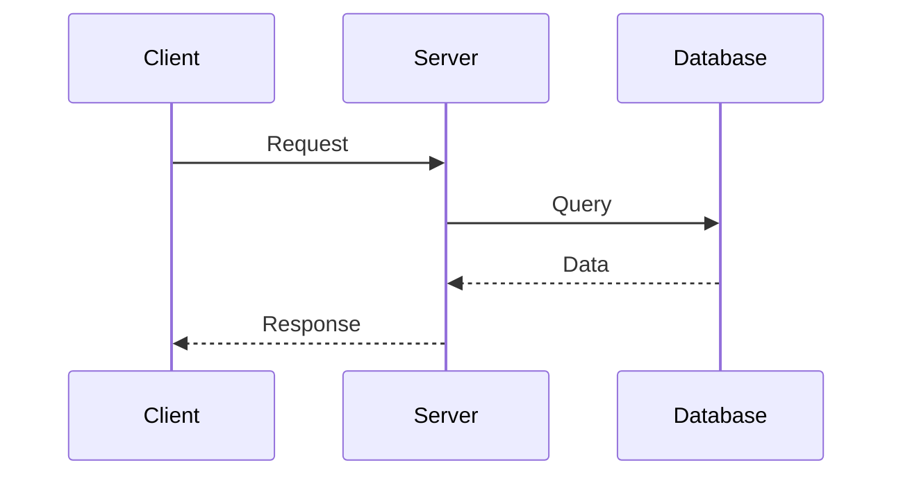
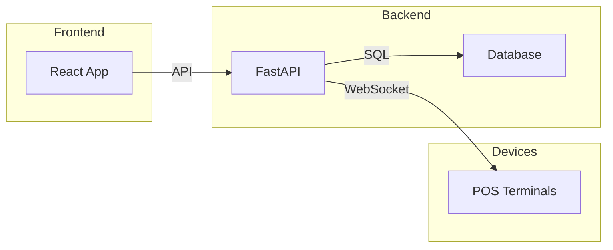
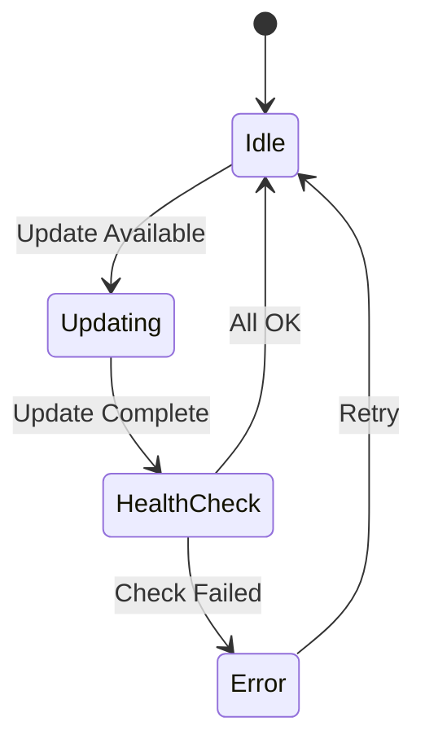

# Image Quick Reference

Quick examples for adding images to HOMEPOT documentation.

## Basic Usage

### Simple Image
```markdown

```

### Image with Size
```markdown
{ width="600" }
```

### Image with Caption
```markdown
<figure markdown>
  
  <figcaption>Dashboard Overview</figcaption>
</figure>
```

## Mermaid Diagrams (Recommended)

### Flowchart
````markdown

````

### Sequence Diagram
````markdown

````

### Architecture Diagram
````markdown

````

### State Diagram
````markdown

````

## Common Patterns

### Dashboard Screenshot
```markdown
## Dashboard Interface

<figure markdown>
  
  <figcaption>Real-time monitoring dashboard with live device status</figcaption>
</figure>
```

### Architecture Diagram
```markdown
## System Architecture

<figure markdown>
  
  <figcaption>HOMEPOT Client System Architecture</figcaption>
</figure>
```

### Logo Header
```markdown
<div align="center">
  
</div>
```

### Feature Grid with Icons
```markdown
<div class="grid cards" markdown>

- :material-monitor:{ .lg .middle } **Real-time**

    { width="48" }
    
    Live monitoring

- :material-shield:{ .lg .middle } **Secure**

    { width="48" }
    
    Enterprise security

</div>
```

## Image Locations

- **Logos**: `docs/images/logos/`
- **Screenshots**: `docs/images/screenshots/`
- **Diagrams**: `docs/images/diagrams/`
- **Icons**: `docs/images/icons/`

## Tips

1. **Use Mermaid** for simple diagrams (version controlled, themed)
2. **Add captions** to explain complex images
3. **Optimize images** before committing (< 500 KB)
4. **Use descriptive filenames**: `pos-device-management.png`
5. **Test locally** with `mkdocs serve`

---

For full documentation, see [images/README.md](README.md)
