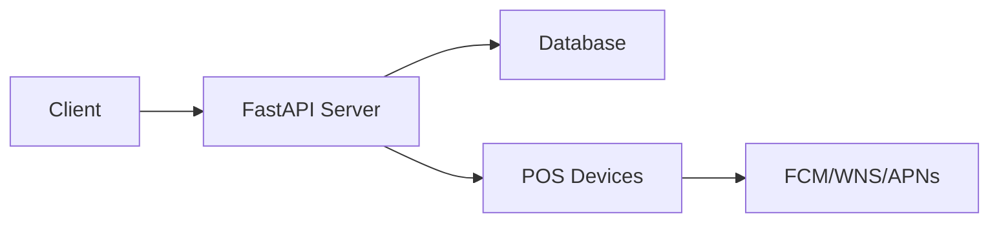

# Documentation Images

This directory contains all visual assets for the HOMEPOT Client documentation.

## Directory Structure

```
images/
├── logos/          # Brand logos, project logos, partner logos
├── screenshots/    # Application screenshots, UI examples
├── diagrams/       # Architecture diagrams, flowcharts, sequence diagrams
├── icons/          # Custom icons, badges, small graphics
└── README.md       # This file
```

## Usage in Documentation

### Basic Image Syntax

```markdown

```

### Image with Caption (Recommended)

```markdown
<figure markdown>
  
  <figcaption>Real-time Dashboard with Live Monitoring</figcaption>
</figure>
```

### Responsive Images

```markdown
{ width="600" }
```

### Images with Links

```markdown
[](https://brunel-opensimhomepot-client.readthedocs.io/en/latest/)
```

### Side-by-Side Images

```markdown
<div class="grid" markdown>

{ width="300" }

{ width="300" }

</div>
```

## Image Types & Guidelines

### 1. Logos (`logos/`)

**Purpose**: Brand identity, project logos, partner logos, service logos

**Examples**:
- `homepot-logo.png` - Main HOMEPOT logo
- `brunel-logo.png` - Brunel University logo
- `consortium-partners.png` - Partner logos
- `fcm-logo.png`, `apns-logo.png`, `wns-logo.png` - Service logos

**Guidelines**:
- **Format**: PNG with transparent background preferred
- **Size**: Maximum 500px width for inline logos
- **Resolution**: 2x resolution for retina displays (e.g., 400x200 saved as 200x100)
- **Naming**: Use kebab-case (lowercase with hyphens)

### 2. Screenshots (`screenshots/`)

**Purpose**: Application UI, dashboards, configuration screens, terminal output

**Examples**:
- `dashboard-overview.png` - Main dashboard view
- `pos-management-list.png` - POS device list
- `real-time-monitoring.png` - Live monitoring interface
- `agent-simulation.png` - Agent simulation view
- `audit-logs.png` - Audit log interface
- `login-screen.png` - Authentication screen

**Guidelines**:
- **Format**: PNG for UI screenshots, JPG for photos
- **Size**: 1200-1600px width (will be responsive)
- **Resolution**: Use high-DPI (retina) screenshots when possible
- **Annotations**: Add arrows/highlights with red/blue colors
- **Privacy**: Redact sensitive information (API keys, passwords, real names)

**Tools for Screenshots**:
- Linux: `gnome-screenshot`, `flameshot`, `shutter`
- macOS: Cmd+Shift+4 (built-in)
- Windows: Snipping Tool, Windows+Shift+S
- Browser: Browser DevTools, Full Page Screen Capture extensions

### 3. Diagrams (`diagrams/`)

**Purpose**: Architecture diagrams, flowcharts, sequence diagrams, entity relationships

**Examples**:
- `system-architecture.png` - Overall system architecture
- `database-schema.png` - Database entity relationships
- `push-notification-flow.png` - Notification flow diagram
- `authentication-flow.png` - Auth sequence diagram
- `deployment-architecture.png` - Deployment topology
- `agent-state-machine.png` - Agent lifecycle states

**Guidelines**:
- **Format**: PNG or SVG (SVG preferred for diagrams)
- **Size**: 800-1200px width
- **Style**: Use consistent colors and shapes
- **Text**: Ensure text is readable at normal zoom levels
- **Background**: White or transparent background

**Recommended Tools**:
- **Draw.io / diagrams.net** (free, web-based or desktop)
- **Mermaid** (markdown-based diagrams - see below)
- **PlantUML** (text-based UML diagrams)
- **Excalidraw** (hand-drawn style diagrams)
- **Lucidchart** (professional diagramming)

### 4. Icons (`icons/`)

**Purpose**: Custom icons, status badges, feature indicators

**Examples**:
- `status-online.svg` - Online status indicator
- `status-offline.svg` - Offline status indicator
- `feature-realtime.svg` - Real-time feature icon
- `feature-secure.svg` - Security feature icon
- `platform-linux.svg` - Linux platform icon
- `platform-windows.svg` - Windows platform icon

**Guidelines**:
- **Format**: SVG preferred for scalability
- **Size**: 24x24, 48x48, or 64x64 pixels
- **Style**: Consistent with Material Design icons
- **Colors**: Use theme colors or monochrome

## Advanced Features

### Mermaid Diagrams (Built-in)

MkDocs Material supports Mermaid diagrams directly in markdown:

````markdown

````

**Mermaid Diagram Types**:
- Flowcharts
- Sequence diagrams
- Class diagrams
- State diagrams
- Entity relationship diagrams
- Gantt charts

**Benefits**:
- Version controlled (text-based)
- No external images needed
- Automatically themed
- Easy to update

### Image Galleries

Create image galleries with grids:

```markdown
<div class="grid cards" markdown>

- :material-monitor-dashboard:{ .lg .middle } **Dashboard**

    ---

    

    Real-time monitoring interface

- :material-devices:{ .lg .middle } **Devices**

    ---

    

    POS device management

</div>
```

### Image Zoom/Lightbox

Material for MkDocs supports image zoom with GLightbox:

Add to `mkdocs.yml`:
```yaml
plugins:
  - glightbox
```

Then images automatically get zoom functionality.

### Dark Mode Support

Provide separate images for light/dark themes:

```markdown


```

## Image Optimization

### Before Committing Images:

1. **Compress images** to reduce file size:
   - PNG: Use `pngquant` or `optipng`
   - JPG: Use `jpegoptim` or online tools
   - SVG: Use `svgo`

2. **Resize large images**:
   ```bash
   # Using ImageMagick
   convert large-image.png -resize 1600x1200\> optimized-image.png
   ```

3. **Check file sizes**:
   - Logos: < 100 KB
   - Screenshots: < 500 KB
   - Diagrams: < 200 KB
   - Icons: < 50 KB

### Optimization Tools

```bash
# Install optimization tools (Linux)
sudo apt install optipng jpegoptim imagemagick

# Optimize PNG
optipng -o7 image.png

# Optimize JPEG
jpegoptim --max=85 image.jpg

# Resize image
convert input.png -resize 1200x800 output.png
```

## Git LFS (Optional)

For large binary files, consider using Git LFS:

```bash
# Install Git LFS
git lfs install

# Track image files
git lfs track "docs/images/**/*.png"
git lfs track "docs/images/**/*.jpg"

# Commit .gitattributes
git add .gitattributes
git commit -m "Add Git LFS for images"
```

## Naming Conventions

### File Naming Rules:

- **Use kebab-case**: `real-time-dashboard.png`
- **Be descriptive**: `pos-device-management-list.png`
  **Include context**: `fcm-integration-flow.svg`
- **Avoid spaces**: ~~`Real Time Dashboard.png`~~
- **Avoid special chars**: ~~`dashboard_(new).png`~~
- **Avoid generic names**: ~~`image1.png`~~

### Version Suffixes (if needed):

- `dashboard-v1.png`, `dashboard-v2.png`
- `architecture-2024.png`, `architecture-2025.png`

## Examples in Documentation

### Homepage Logo

```markdown
# HOMEPOT Documentation

<div align="center">
  
</div>

Welcome to HOMEPOT...
```

### Architecture Diagram

```markdown
## System Architecture

<figure markdown>
  
  <figcaption>HOMEPOT Client Architecture Overview</figcaption>
</figure>
```

### Feature Showcase

```markdown
## Key Features

<div class="grid cards" markdown>

- { width="48" }
  **Real-time Monitoring**
  
  WebSocket-powered live dashboard

- { width="48" }
  **Enterprise Security**
  
  End-to-end encryption

</div>
```

### Screenshot with Annotations

```markdown
### Dashboard Interface


The dashboard provides:

1. Live device status (green markers)
2. Real-time updates via WebSocket
3. Quick action buttons (top right)
```

## Resources

### Free Icon Libraries:
- **Material Icons**: https://fonts.google.com/icons
- **Font Awesome**: https://fontawesome.com/icons
- **Feather Icons**: https://feathericons.com/
- **Heroicons**: https://heroicons.com/

### Free Stock Photos:
- **Unsplash**: https://unsplash.com/
- **Pexels**: https://pexels.com/
- **Pixabay**: https://pixabay.com/

### Diagram Tools:
- **Draw.io**: https://app.diagrams.net/
- **Excalidraw**: https://excalidraw.com/
- **Mermaid Live**: https://mermaid.live/

### Image Optimization:
- **TinyPNG**: https://tinypng.com/
- **Squoosh**: https://squoosh.app/
- **SVGOMG**: https://jakearchibald.github.io/svgomg/

## Quick Start

1. **Add your image** to the appropriate subdirectory:
   ```bash
   cp ~/Downloads/dashboard.png docs/images/screenshots/
   ```

2. **Reference in documentation**:
   ```markdown
   
   ```

3. **Test locally**:
   ```bash
   mkdocs serve
   # Visit http://127.0.0.1:8000/
   ```

4. **Commit and push**:
   ```bash
   git add docs/images/
   git commit -m "docs: Add dashboard screenshot"
   git push
   ```

## Best Practices Summary

**DO**:
- Use descriptive filenames
- Optimize images before committing
- Provide alt text for accessibility
- Use consistent image sizes within categories
- Add captions to explain complex images
- Use SVG for diagrams when possible
- Use Mermaid for simple diagrams (version controlled)

**DON'T**:
- Commit huge unoptimized images (> 1MB)
- Use screenshots with sensitive data
- Use generic names (image1.png)
- Include copyrighted images without permission
- Use inconsistent image styles

---

**Need help?** Check the [MkDocs Material Images documentation](https://squidfunk.github.io/mkdocs-material/reference/images/)
