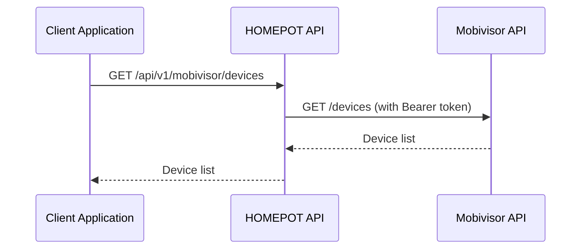

# Mobivisor Integration

This guide explains how to integrate HOMEPOT with the Mobivisor device management service.

## Overview

Mobivisor is an external device management service provided by Dealdio. The HOMEPOT system can integrate with Mobivisor to:

- **Fetch device information** from Mobivisor's centralized system
- **Query specific devices** by their unique IDs
- **Delete devices** from the Mobivisor platform

The integration uses proxy endpoints that forward requests to Mobivisor's API with proper authentication and error handling.

## Architecture



## API Endpoints

### 1. List All Devices

Fetch all devices from Mobivisor.

**Endpoint**: `GET /api/v1/mobivisor/devices`

**Response** (200 OK):
```json
{
  "devices": [
    {
      "id": "123",
      "name": "Device 1",
      "status": "online"
    },
    {
      "id": "456",
      "name": "Device 2",
      "status": "offline"
    }
  ]
}
```

**Example**:
```bash
curl -X GET "http://localhost:8000/api/v1/mobivisor/devices"
```

### 2. Get Device Details

Fetch details for a specific device.

**Endpoint**: `GET /api/v1/mobivisor/devices/{device_id}`

**Parameters**:
- `device_id` (path): The unique identifier of the device

**Response** (200 OK):
```json
{
  "id": "123",
  "name": "Device 1",
  "status": "online",
  "last_seen": "2025-10-18T10:30:00Z",
  "location": "Store A",
  "firmware_version": "1.2.3"
}
```

**Example**:
```bash
curl -X GET "http://localhost:8000/api/v1/mobivisor/devices/123"
```

### 3. Delete Device

Delete a device from Mobivisor.

**Endpoint**: `DELETE /api/v1/mobivisor/devices/{device_id}`

**Parameters**:
- `device_id` (path): The unique identifier of the device to delete

**Response** (200 OK):
```json
{
  "message": "Device deleted successfully",
  "device_id": "123"
}
```

**Example**:
```bash
curl -X DELETE "http://localhost:8000/api/v1/mobivisor/devices/123"
```

### 4. Get Installed Packages

Fetch the list of installed packages (enterprise apps) on a specific device managed by Mobivisor.

**Endpoint**: `GET /api/v1/mobivisor/devices/{device_id}/installed-packages`

**Parameters**:
- `device_id` (path): The unique identifier of the device

**Response** (200 OK):
```json
{
  "installed_packages": [
    {
      "package_id": "com.example.app1",
      "name": "Example App",
      "version": "1.0.0",
      "installed_at": "2025-10-01T12:00:00Z"
    },
    {
      "package_id": "com.example.app2",
      "name": "Another App",
      "version": "2.3.1",
      "installed_at": "2025-09-23T09:47:00Z"
    }
  ]
}
```

**Example**:
```bash
curl -X GET "http://localhost:8000/api/v1/mobivisor/devices/123/installed-packages"
```

**Notes & Errors**:
- `404 Not Found`: Returned when the specified `device_id` does not exist in Mobivisor.
- `403/401 Unauthorized`: Returned when the configured Mobivisor token is invalid or lacks permission.
- `502 Bad Gateway`: Returned when Mobivisor responds with an error (upstream error).
- `504 Gateway Timeout`: Returned when Mobivisor does not respond within the configured timeout window.

Refer to the "Error Handling" section above for example error payloads and suggested remediation steps.

### 5. Delete Installed Package

Delete a specific installed enterprise application from a device managed by Mobivisor.

**Endpoint**: `DELETE /api/v1/mobivisor/devices/{device_id}/delete-installed-package/{package_id}`

**Parameters**:
- `device_id` (path): The unique identifier of the device
- `package_id` (path): The unique identifier (package id) of the installed application

**Response** (200 OK):
```json
{
  "message": "Package removed",
  "device_id": "123",
  "package_id": "com.example.app1"
}
```

**Example**:
```bash
curl -X DELETE "http://localhost:8000/api/v1/mobivisor/devices/123/delete-installed-package/com.example.app1"
```

**Notes & Errors**:
- `404 Not Found`: Device or package not found on Mobivisor.
- `403/401 Unauthorized`: Returned when the configured Mobivisor token is invalid or lacks delete permission.
- `502 Bad Gateway`: Mobivisor returned an upstream error.
- `504 Gateway Timeout`: Mobivisor did not respond in time.

### 6. Get Managed Apps

Fetch the list of managed apps available/assigned to a specific device in Mobivisor.

**Endpoint**: `GET /api/v1/mobivisor/devices/{device_id}/get-managed-apps`

**Parameters**:
- `device_id` (path): The unique identifier of the device

**Response** (200 OK):
```json
{
  "managed_apps": [
    {
      "app_id": "com.example.app1",
      "name": "Example App",
      "version": "1.0.0",
      "managed": true
    }
  ]
}
```

**Example**:
```bash
curl -X GET "http://localhost:8000/api/v1/mobivisor/devices/123/get-managed-apps"
```

**Notes & Errors**:
- `404 Not Found`: Device not present in Mobivisor.
- `403/401 Unauthorized`: Authentication/authorization issue.
- `502 Bad Gateway` / `504 Gateway Timeout`: Upstream errors or timeouts.

### Get Device Policies

Fetch the policies currently applied to a specific device in Mobivisor.

**Endpoint**: `GET /api/v1/mobivisor/devices/{device_id}/policies`

**Parameters**:
- `device_id` (path): The unique identifier of the device (required)

**Response** (200 OK):
```json
{
  "policies": [
    {"id": "p1", "name": "KioskPolicy", "enabled": true}
  ]
}
```

**Example**:
```bash
curl -X GET "http://localhost:8000/api/v1/mobivisor/devices/123/policies"
```

**Notes & Errors**:
- `404 Not Found`: Device does not exist or no policies found on Mobivisor.
- `401/403 Unauthorized`: Missing or invalid token or insufficient permissions.
- `502 Bad Gateway` / `504 Gateway Timeout`: Upstream errors or timeouts.

### Fetch System Apps by Model & Version

Fetch the list of system (system-level) apps for a device model and specific
version. This proxies Mobivisor's
`GET /devices/fetchSystemApps/model/{model_number}/version/{version_number}`
endpoint.

**Endpoint**: `GET /api/v1/mobivisor/devices/fetchSystemApps/model/{model_number}/version/{version_number}`

**Path Parameters**:
- `model_number` (path): Device model identifier (required)
- `version_number` (path): Device software/firmware version (required)

**Response** (200 OK):
```json
{
  "systemApps": [
    {"package": "com.example.app", "name": "Example App", "version": "1.0"}
  ]
}
```

**Example**:
```bash
curl -X GET "http://localhost:8000/api/v1/mobivisor/devices/fetchSystemApps/model/SM-G998/version/1.2.3"
```

**Notes & Errors**:
- `400 Bad Request`: Malformed model or version values (path parameters are required).
- `404 Not Found`: No system apps found for the provided model/version on Mobivisor.
- `401/403 Unauthorized`: Missing or invalid token or insufficient permissions.
- `502 Bad Gateway` / `504 Gateway Timeout`: Upstream errors or timeouts.

### 8. Mobivisor Groups

These endpoints provide group management proxying to the Mobivisor API.

#### 1. List All Groups

Fetch all groups from Mobivisor.

**Endpoint**: `GET /api/v1/mobivisor/groups`

**Response** (200 OK):
```json
{
  "groups": [
    {"id": "g1", "name": "Stores - Region A"},
    {"id": "g2", "name": "Kiosk Devices"}
  ]
}
```

**Example**:
```bash
curl -X GET "http://localhost:8000/api/v1/mobivisor/groups"
```

**Notes & Errors**:
- `404 Not Found`: No groups found for the environment (or group-level resource missing).
- `401/403 Unauthorized`: Authentication/authorization issue.
- `502 Bad Gateway` / `504 Gateway Timeout`: Upstream errors or timeouts.

#### 2. Delete Group

Delete a specific group from Mobivisor.

**Endpoint**: `DELETE /api/v1/mobivisor/groups/{group_id}`

**Parameters**:
- `group_id` (path): The unique identifier of the group to delete.

**Response** (200 OK):
```json
{}
```

> Note: The endpoint proxies the Mobivisor delete and returns the proxied response. When Mobivisor returns a 204 No Content, the proxy will return an empty JSON object.

**Example**:
```bash
curl -X DELETE "http://localhost:8000/api/v1/mobivisor/groups/g1"
```

**Notes & Errors**:
- `404 Not Found`: Group does not exist on Mobivisor.
- `401/403 Unauthorized`: Missing or invalid token or insufficient permissions.
- `502/504`: Upstream errors/timeouts.

#### 3. Get Group Details

Fetch details for a specific group managed by Mobivisor.

**Endpoint**: `GET /api/v1/mobivisor/groups/{group_id}`

**Parameters**:
- `group_id` (path): The unique identifier of the group

**Response** (200 OK):
```json
{
  "id": "g1",
  "name": "Stores - Region A",
  "device_count": 42,
  "description": "Retail stores in Region A"
}
```

**Example**:
```bash
curl -X GET "http://localhost:8000/api/v1/mobivisor/groups/g1"
```

## Debug Logs

Fetch debug logs from the Mobivisor service. This proxies the external
`GET https://mydd.mobivisor.com/debuglogs` endpoint so support teams can
retrieve diagnostic log output via the HOMEPOT API. Access to this endpoint
requires a properly configured `mobivisor_api_token` with sufficient
privileges.

**Endpoint**: `GET /api/v1/mobivisor/debuglogs`

**Response** (200 OK):
```json
{
  "logs": ["line1", "line2", "..."]
}
```

**Example**:
```bash
curl -X GET "http://localhost:8000/api/v1/mobivisor/debuglogs"
```

**Notes & Errors**:
- `500 Configuration Error`: Missing `mobivisor_api_url` or `mobivisor_api_token`.
- `401/403 Unauthorized`: Upstream returned unauthorized (token invalid or insufficient scope).
- `502 Bad Gateway`: Network or upstream error.
- `504 Gateway Timeout`: Upstream did not respond in time.


### 7. Device Commands

Fetch device command records (audit/commands) from Mobivisor with pagination
and search support. This proxies the Mobivisor endpoint
`GET /devicescommands` and accepts the common query parameters.

**Endpoint**: `GET /api/v1/mobivisor/devices/commands`

**Query Parameters**:
- `order` (string, optional): sort field (example: `timeCreated`)
- `page` (int, optional): page number (default 0)
- `per_page` (int, optional): items per page (default 20)
- `reverse` (bool|string, optional): `true`/`false` (default `true`)
- `search` (string, optional): JSON encoded search/filter object (default `{}`)

**Response** (200 OK):
```json
{
  "commands": [
    {"id": "c1", "command": "refresh", "timeCreated": "2025-12-01T12:00:00Z"}
  ],
  "page": 0,
  "per_page": 20
}
```

**Example**:
```bash
curl -G "http://localhost:8000/api/v1/mobivisor/devices/commands" \
  --data-urlencode "order=timeCreated" \
  --data-urlencode "page=0" \
  --data-urlencode "per_page=20" \
  --data-urlencode "reverse=true" \
  --data-urlencode "search={}" 
```

**Notes & Errors**:
- `500 Configuration Error`: Missing `MOBIVISOR_API_URL` or other config issues.
- `401/403 Unauthorized`: Authentication/authorization issue.
- `502 Bad Gateway`: Upstream Mobivisor errors.
- `504 Gateway Timeout`: Upstream did not respond in time.

**Notes & Errors**:
- `404 Not Found`: Group does not exist on Mobivisor.
- `401/403 Unauthorized`: Missing or invalid token or insufficient permissions.
- `502 Bad Gateway` / `504 Gateway Timeout`: Upstream errors or timeouts.


#### 4. Add Applications To Group

Add one or more applications to a specific group in Mobivisor.

**Endpoint**: `PUT /api/v1/mobivisor/groups/{group_id}/applications`

**Path Parameters**:
- `group_id` (path, required): The unique identifier of the group

**Request Body** (JSON):
```json
{
  "appIds": [
    "6895b52aefdcda141d3a8da5",
    "689c7d4e40257462671afcfc"
  ],
  "appConfigs": []
}
```

**Validation**:
- `appIds` is required and must be a non-empty array of application IDs.
- `appConfigs` is optional and should be an array of configuration objects.

**Response** (200 OK):
```json
{ "ok": true }
```

**Example**:
```bash
curl -X PUT "http://localhost:8000/api/v1/mobivisor/groups/g1/applications" \
  -H "Content-Type: application/json" \
  -d '{"appIds":["6895b52aefdcda141d3a8da5"], "appConfigs": []}'
```

**Notes & Errors**:
- `422 Validation Error`: Missing or invalid `appIds`.
- `404 Not Found`: Group does not exist on Mobivisor.
- `401/403 Unauthorized`: Missing or invalid token or insufficient permissions.
- `502 Bad Gateway` / `504 Gateway Timeout`: Upstream errors or timeouts.

#### 5. Add Users To Group

Add one or more existing users to a specific group in Mobivisor.

**Endpoint**: `PUT /api/v1/mobivisor/groups/{group_id}/users`

**Path Parameters**:
- `group_id` (path, required): The unique identifier of the group

**Request Body** (JSON):
```json
{
  "users": [
    "6807a5836415f4ed1ee081ea",
    "680a4cb660e6a191fc7e1d15"
  ]
}
```

**Validation**:
- `users` is required and must be a non-empty array of user IDs.

**Response** (200 OK):
```json
{ "ok": true }
```

**Example**:
```bash
curl -X PUT "http://localhost:8000/api/v1/mobivisor/groups/g1/users" \
  -H "Content-Type: application/json" \
  -d '{"users":["6807a5836415f4ed1ee081ea","680a4cb660e6a191fc7e1d15"]}'
```

**Notes & Errors**:
- `422 Validation Error`: Missing or invalid `users`.
- `404 Not Found`: Group does not exist on Mobivisor.
- `401/403 Unauthorized`: Missing or invalid token or insufficient permissions.
- `502 Bad Gateway` / `504 Gateway Timeout`: Upstream errors or timeouts.

### Mobivisor Users

The following endpoints provide basic user management proxying to the Mobivisor API.

#### 1. List All Users

Fetch all users from Mobivisor.

**Endpoint**: `GET /api/v1/mobivisor/users`

**Response** (200 OK):
```json
{
  "users": [
    {"id": "u1", "name": "User One"},
    {"id": "u2", "name": "User Two"}
  ]
}
```

**Example**:
```bash
curl -X GET "http://localhost:8000/api/v1/mobivisor/users"
```

#### 2. Get User Details

Fetch details for a specific user.

**Endpoint**: `GET /api/v1/mobivisor/users/{user_id}`

**Parameters**:
- `user_id` (path): The unique identifier of the user

**Response** (200 OK):
```json
{
  "id": "u1",
  "name": "User One",
  "email": "user.one@example.com",
  "last_seen": "2025-10-18T10:30:00Z"
}
```

**Example**:
```bash
curl -X GET "http://localhost:8000/api/v1/mobivisor/users/u1"
```

#### 3. Delete User

Delete a user from Mobivisor.

**Endpoint**: `DELETE /api/v1/mobivisor/users/{user_id}`

**Parameters**:
- `user_id` (path): The unique identifier of the user to delete

**Response** (200 OK):
```json
{
  "message": "User deleted successfully",
  "user_id": "u1"
}
```

**Example**:
```bash
curl -X DELETE "http://localhost:8000/api/v1/mobivisor/users/u1"
```

**Notes & Errors**:
- `404 Not Found`: User does not exist on Mobivisor.
- `403/401 Unauthorized`: Missing or invalid token or insufficient permissions.
- `502/504`: Upstream errors/timeouts.

Refer to the "Error Handling" section above for example error payloads and suggested remediation steps.

### 7. Get Device Applications

Fetch the list of applications associated with a specific device. This endpoint was recently added and proxies to Mobivisor's `devices/{device_id}/applications` endpoint.

**Endpoint**: `GET /api/v1/mobivisor/devices/{device_id}/applications`

**Parameters**:
- `device_id` (path): The unique identifier of the device

**Response** (200 OK):
```json
{
  "applications": [
    {
      "app_id": "com.example.app1",
      "name": "Example App",
      "version": "1.0.0",
      "installed": true
    }
  ]
}
```

**Example**:
```bash
curl -X GET "http://localhost:8000/api/v1/mobivisor/devices/123/applications"
```

**Notes & Errors**:
- `404 Not Found`: Device not present in Mobivisor.
- `403/401 Unauthorized`: Authentication/authorization issue.
- `502 Bad Gateway` / `504 Gateway Timeout`: Upstream errors or timeouts.

### Trigger Device Actions

Issue commands such as password resets, kiosk refreshes, and telemetry updates to a Mobivisor-managed device.

**Endpoint**: `PUT /api/v1/mobivisor/devices/{device_id}/actions`

**Request Body** (JSON):
```json
{
  "deviceId": "6895b35f73796d4ff80a57a0",
  "commandType": "update_settings",
  "commandData": {
    "sendApps": false
  }
}
```

**Supported commandType values**:

| commandType | Purpose | Required commandData keys |
| --- | --- | --- |
| `change_password_now` | Force a password rotation | `password` (string) |
| `update_settings` | Toggle telemetry flags | `sendApps` (boolean) |
| `refresh_kiosk` | Refresh kiosk launcher config | _(none)_ |
| `pref_update` | Update cached preferences / user state | Optional `userId`, `userSwitched` |
| `location_request` | Request latest GPS ping | _(none)_ |
| `status_request` | Request a status snapshot | _(none)_ |
| `password_token_request` | Generate a temporary password token | _(none)_ |
| `fetch_system_apps` | Ask device to enumerate system apps | _(none)_ |

**Response** (200 OK):
```json
{
  "__v": 0,
  "user": "6895b35f73796d4ff80a57a0",
  "userName": "admin",
  "commandData": "{}",
  "commandType": "Fetch System Apps",
  "commandTypeOldFormat": "fetch_system_apps",
  "environment": "Android Enterprise",
  "_id": "69328eb219a2fefab2e0d64b",
  "status": "Not Sent",
  "timeCreated": "2025-12-05T07:50:10.232Z"
}
```

**Example**:
```bash
curl -X PUT "http://localhost:8000/api/v1/mobivisor/devices/6895b35f73796d4ff80a57a0/actions" \
  -H "Content-Type: application/json" \
  -d '{"deviceId":"6895b35f73796d4ff80a57a0","commandType":"fetch_system_apps","commandData":{}}'
```

**Notes & Errors**:
- The `deviceId` inside the payload must match the `{device_id}` in the URL path or a `400 Validation Error` is returned.
- Field-level validation ensures `commandData.password` exists for `change_password_now` and `commandData.sendApps` exists for `update_settings`.
- Upstream Mobivisor errors (401/403/404/5xx) are proxied with the original status embedded in the `detail.upstream_status` field when available.

### Update Device Description

Update the human-readable description for a device in Mobivisor. This proxies
the Mobivisor endpoint `PUT /devices/{device_id}/description`.

**Endpoint**: `PUT /api/v1/mobivisor/devices/{device_id}/description`

**Request Body** (JSON):
```json
{
  "description": "Test"
}
```

**Validation**:
- `description` is required and must be a non-empty string.

**Response** (200 OK):
```json
{ "ok": true }
```

**Example**:
```bash
curl -X PUT "http://localhost:8000/api/v1/mobivisor/devices/6895b35f73796d4ff80a57a0/description" \
  -H "Content-Type: application/json" \
  -d '{"description":"Test"}'
```

**Notes & Errors**:
- `422 Validation Error`: Missing or invalid `description` value.
- `500 Configuration Error`: Missing `mobivisor_api_url` or `mobivisor_api_token`.
- `401/403 Unauthorized`: Upstream returned unauthorized (token invalid or insufficient scope).
- `502 Bad Gateway` / `504 Gateway Timeout`: Upstream errors or timeouts.

### Mobivisor Users (Additional)

#### 4. Create User

Create a new user in Mobivisor by proxying a POST to the Mobivisor `/users` endpoint. This endpoint was recently added and performs server-side validation for required fields before forwarding the request upstream.

**Endpoint**: `POST /api/v1/mobivisor/users`

**Request Body** (JSON):
```json
{
  "user": {
    "email": "jr.kothiya@gmail.com",
    "displayName": "Kothiya Yogesh",
    "username": "jr.kothiya",
    "phone": "7567407883",
    "password": "1234567890",
    "notes": "Test",
    "role": {"_id": "Admin", "rights": [], "displayedRights": []}
  },
  "groupInfoOfTheUser": [{"_id": "6895b47e634b34c01c2d69c4"}]
}
```

**Validation**:
- The `user` object is required.
- Required fields inside `user`: `email`, `displayName`, `username`, `phone`, `password`.
- The endpoint performs a simple email format validation and will return `400 Bad Request` if the email is invalid.

**Response** (201 Created / 2xx):
```json
{
  "user": {
    "id": "new_user_id",
    "email": "jr.kothiya@gmail.com",
    "username": "jr.kothiya",
    "displayName": "Kothiya Yogesh"
  }
}
```

**Example**:
```bash
curl -X POST "http://localhost:8000/api/v1/mobivisor/users" \
  -H "Content-Type: application/json" \
  -d '{"user": {"email": "jr.kothiya@gmail.com", "displayName": "Kothiya Yogesh", "username": "jr.kothiya", "phone": "7567407883", "password": "1234567890"}}'
```

**Notes & Errors**:
- `400 Bad Request`: Missing `user` object or required fields, or invalid email format.
- `401/403 Unauthorized`: Upstream authentication/authorization error; token missing/invalid.
- `502 Bad Gateway`: Mobivisor returned an upstream error; the response includes `upstream_status`.
- `504 Gateway Timeout`: Mobivisor did not respond in time.

Refer to the "Error Handling" section for example error payloads and remediation steps.

#### 5. Update User

Update an existing user in Mobivisor by proxying a `PUT` to the Mobivisor `/users/{user_id}` endpoint.

**Endpoint**: `PUT /api/v1/mobivisor/users/{user_id}`

**Request Body** (JSON):
```json
{
  "user": {
    "email": "a11@b.c",
    "username": "jr11b.kothiya",
    "displayName": "Kothiya Yogesh",
    "password": "1234567890",
    "notes": "Test",
    "phone": "7567407883",
    "_id": "6930491019a2fefab2e0b300",
    "role": {"_id": "Admin", "rights": [], "displayedRights": []}
  },
  "groupInfoOfTheUser": [
    {"admin": true, "_id": "6895b47e634b34c01c2d69c4"}
  ]
}
```

**Example**:
```bash
curl -X PUT "http://localhost:8000/api/v1/mobivisor/users/6930491019a2fefab2e0b300" \
  -H "Content-Type: application/json" \
  -d '@update_user_payload.json'
```

**Response** (200 OK):
```json
{
  "id": "6930491019a2fefab2e0b300",
  "email": "a11@b.c",
  "username": "jr11b.kothiya",
  "displayName": "Kothiya Yogesh"
}
```

**Notes & Errors**:
- Partial updates are supported: all `user` fields are optional for `PUT` and only provided fields are forwarded to Mobivisor.
- `422 Validation Error`: Invalid field values (for example, malformed `email`) will return a 422.
- `401/403 Unauthorized`: Upstream authentication/authorization error; token missing/invalid.
- `404 Not Found`: User does not exist on Mobivisor.
- `502 Bad Gateway` / `504 Gateway Timeout`: Upstream errors or timeouts.

Use the same `MOBIVISOR_API_URL` and `MOBIVISOR_API_TOKEN` configuration described above.

## Configuration

### Environment Variables

Configure the Mobivisor integration using environment variables:

```bash
# Mobivisor API Base URL
MOBIVISOR_API_URL=https://mydd.mobivisor.com/

# Mobivisor Bearer Token
MOBIVISOR_API_TOKEN=your_bearer_token_here
```

### Configuration File (.env)

Add to your `.env` file:

```ini
# Mobivisor Integration
MOBIVISOR_API_URL=https://mydd.mobivisor.com/
MOBIVISOR_API_TOKEN=eyJhbGciOiJIUzI1NiIsInR5cCI6IkpXVCJ9...
```

### Obtaining API Credentials

To get your Mobivisor API credentials:

1. Contact your Dealdio representative
2. Request API access for your organization
3. Obtain your Bearer token from the Mobivisor dashboard
4. Configure the token in your environment

!!! warning "Security"
    Never commit your Bearer token to version control. Always use environment variables or secure secret management.

## Error Handling

The Mobivisor endpoints provide comprehensive error handling:

### Configuration Errors (500)

**Scenario**: Missing URL or token configuration

```json
{
  "detail": {
    "error": "Configuration Error",
    "message": "Mobivisor API URL is not configured"
  }
}
```

**Solution**: Check your environment variables and ensure both `MOBIVISOR_API_URL` and `MOBIVISOR_API_TOKEN` are set.

### Unauthorized (401/403)

**Scenario**: Invalid or expired Bearer token

```json
{
  "detail": {
    "error": "Unauthorized",
    "message": "Invalid or missing Bearer token for Mobivisor API",
    "upstream_status": 401
  }
}
```

**Solution**: Verify your Bearer token is correct and not expired.

### Not Found (404)

**Scenario**: Device doesn't exist

```json
{
  "detail": {
    "error": "Not Found",
    "message": "Resource not found on Mobivisor API"
  }
}
```

**Solution**: Verify the device ID is correct.

### Bad Gateway (502)

**Scenario**: Mobivisor API returned an error

```json
{
  "detail": {
    "error": "Bad Gateway",
    "message": "Mobivisor API returned error 500",
    "upstream_status": 500,
    "upstream_error": {
      "error": "Internal server error"
    }
  }
}
```

**Solution**: Wait and retry. If the problem persists, contact Mobivisor support.

### Gateway Timeout (504)

**Scenario**: Mobivisor API didn't respond in time

```json
{
  "detail": {
    "error": "Gateway Timeout",
    "message": "Mobivisor API did not respond in time"
  }
}
```

**Solution**: Retry the request. The timeout is set to 10 seconds total (5 seconds for connection).

## Testing

### Running Tests

The Mobivisor integration includes comprehensive unit tests:

```bash
# Run Mobivisor tests
pytest backend/tests/test_mobivisor.py -v

# Run with coverage
pytest backend/tests/test_mobivisor.py --cov=homepot.app.api.API_v1.Endpoints.Mobivisor

# Run specific test
pytest backend/tests/test_mobivisor.py::TestMobivisorDevicesEndpoints::test_fetch_devices_success -v
```

### Test Coverage

The test suite covers:

- Successful device list fetch
- Successful device details fetch
- Successful device deletion
- Missing configuration (URL/token)
- Unauthorized responses (401/403)
- Device not found (404)
- Timeout scenarios (504)
- Network errors (502)
- Upstream service errors (502)

### Manual Testing

Test the integration using curl:

```bash
# 1. Test device list (replace with your token)
export TOKEN="your_bearer_token_here"
curl -X GET "http://localhost:8000/api/v1/mobivisor/devices" \
  -H "Content-Type: application/json"

# 2. Test device details
curl -X GET "http://localhost:8000/api/v1/mobivisor/devices/123"

# 3. Test device deletion
curl -X DELETE "http://localhost:8000/api/v1/mobivisor/devices/123"
```

## Troubleshooting

### Issue: "Configuration Error: Mobivisor API URL is not configured"

**Cause**: Environment variable not set

**Solution**:
```bash
export MOBIVISOR_API_URL=https://mydd.mobivisor.com/
```

Or add to `.env` file.

### Issue: "Unauthorized" errors

**Cause**: Invalid or expired Bearer token

**Solution**:
1. Verify token is correct
2. Check token hasn't expired
3. Request new token from Mobivisor dashboard

### Issue: "Gateway Timeout" errors

**Cause**: Mobivisor API is slow or unavailable

**Solution**:
1. Check Mobivisor service status
2. Retry after a few seconds
3. Contact Mobivisor support if persistent

### Issue: Devices not showing up

**Cause**: Empty device list or wrong environment

**Solution**:
1. Verify you're connecting to the correct Mobivisor environment
2. Check if devices exist in the Mobivisor dashboard
3. Verify API token has correct permissions

## Security Best Practices

### Token Management

1. **Never commit tokens**: Use `.env` files (in `.gitignore`)
2. **Rotate tokens regularly**: Update tokens every 90 days
3. **Use environment-specific tokens**: Different tokens for dev/staging/production
4. **Store securely**: Use secrets managers (AWS Secrets Manager, HashiCorp Vault)

### Network Security

1. **Use HTTPS**: Always use secure connections to Mobivisor
2. **Validate responses**: Check response structure before processing
3. **Rate limiting**: Implement rate limiting to prevent abuse
4. **Logging**: Log API calls (without tokens) for audit purposes

## Integration Checklist

Before deploying Mobivisor integration to production:

- Obtain Mobivisor API credentials from Dealdio
- Set `MOBIVISOR_API_URL` environment variable
- Set `MOBIVISOR_API_TOKEN` environment variable
- Test all endpoints (list, details, delete)
- Verify error handling works correctly
- Run full test suite and verify 100% pass
- Document token rotation procedures
- Set up monitoring and alerting
- Train team on Mobivisor integration

## API Documentation

For more details on the Mobivisor API, visit the interactive API documentation:

- **Swagger UI**: http://localhost:8000/docs
- **ReDoc**: http://localhost:8000/redoc

Navigate to the "Mobivisor Devices" section to try the endpoints interactively.

## Support

### HOMEPOT Support

For issues with the HOMEPOT integration:
- GitHub Issues: [brunel-opensim/homepot-client/issues](https://github.com/brunel-opensim/homepot-client/issues)
- Documentation: [https://homepot-client.readthedocs.io](https://homepot-client.readthedocs.io)

### Mobivisor Support

For issues with Mobivisor API or credentials:
- Contact: Dealdio Support Team
- Email: support@dealdio.com (example)
- Dashboard: https://mydd.mobivisor.com/

---

**Contributors**: This integration was originally developed by the Dealdio team and ported to the monorepo structure by the HOMEPOT consortium.
