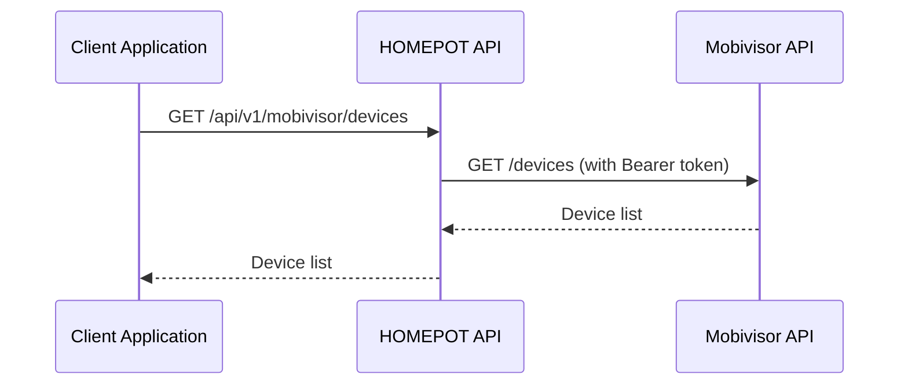

# Mobivisor Integration

This guide explains how to integrate HOMEPOT with the Mobivisor device management service.

## Overview

Mobivisor is an external device management service provided by Dealdio. The HOMEPOT system can integrate with Mobivisor to:

- **Fetch device information** from Mobivisor's centralized system
- **Query specific devices** by their unique IDs
- **Delete devices** from the Mobivisor platform

The integration uses proxy endpoints that forward requests to Mobivisor's API with proper authentication and error handling.

## Architecture



## API Endpoints

### 1. List All Devices

Fetch all devices from Mobivisor.

**Endpoint**: `GET /api/v1/mobivisor/devices`

**Response** (200 OK):
```json
{
  "devices": [
    {
      "id": "123",
      "name": "Device 1",
      "status": "online"
    },
    {
      "id": "456",
      "name": "Device 2",
      "status": "offline"
    }
  ]
}
```

**Example**:
```bash
curl -X GET "http://localhost:8000/api/v1/mobivisor/devices"
```

### 2. Get Device Details

Fetch details for a specific device.

**Endpoint**: `GET /api/v1/mobivisor/devices/{device_id}`

**Parameters**:
- `device_id` (path): The unique identifier of the device

**Response** (200 OK):
```json
{
  "id": "123",
  "name": "Device 1",
  "status": "online",
  "last_seen": "2025-10-18T10:30:00Z",
  "location": "Store A",
  "firmware_version": "1.2.3"
}
```

**Example**:
```bash
curl -X GET "http://localhost:8000/api/v1/mobivisor/devices/123"
```

### 3. Delete Device

Delete a device from Mobivisor.

**Endpoint**: `DELETE /api/v1/mobivisor/devices/{device_id}`

**Parameters**:
- `device_id` (path): The unique identifier of the device to delete

**Response** (200 OK):
```json
{
  "message": "Device deleted successfully",
  "device_id": "123"
}
```

**Example**:
```bash
curl -X DELETE "http://localhost:8000/api/v1/mobivisor/devices/123"
```

## Configuration

### Environment Variables

Configure the Mobivisor integration using environment variables:

```bash
# Mobivisor API Base URL
MOBIVISOR_API_URL=https://mydd.mobivisor.com/

# Mobivisor Bearer Token
MOBIVISOR_API_TOKEN=your_bearer_token_here
```

### Configuration File (.env)

Add to your `.env` file:

```ini
# Mobivisor Integration
MOBIVISOR_API_URL=https://mydd.mobivisor.com/
MOBIVISOR_API_TOKEN=eyJhbGciOiJIUzI1NiIsInR5cCI6IkpXVCJ9...
```

### Obtaining API Credentials

To get your Mobivisor API credentials:

1. Contact your Dealdio representative
2. Request API access for your organization
3. Obtain your Bearer token from the Mobivisor dashboard
4. Configure the token in your environment

!!! warning "Security"
    Never commit your Bearer token to version control. Always use environment variables or secure secret management.

## Error Handling

The Mobivisor endpoints provide comprehensive error handling:

### Configuration Errors (500)

**Scenario**: Missing URL or token configuration

```json
{
  "detail": {
    "error": "Configuration Error",
    "message": "Mobivisor API URL is not configured"
  }
}
```

**Solution**: Check your environment variables and ensure both `MOBIVISOR_API_URL` and `MOBIVISOR_API_TOKEN` are set.

### Unauthorized (401/403)

**Scenario**: Invalid or expired Bearer token

```json
{
  "detail": {
    "error": "Unauthorized",
    "message": "Invalid or missing Bearer token for Mobivisor API",
    "upstream_status": 401
  }
}
```

**Solution**: Verify your Bearer token is correct and not expired.

### Not Found (404)

**Scenario**: Device doesn't exist

```json
{
  "detail": {
    "error": "Not Found",
    "message": "Resource not found on Mobivisor API"
  }
}
```

**Solution**: Verify the device ID is correct.

### Bad Gateway (502)

**Scenario**: Mobivisor API returned an error

```json
{
  "detail": {
    "error": "Bad Gateway",
    "message": "Mobivisor API returned error 500",
    "upstream_status": 500,
    "upstream_error": {
      "error": "Internal server error"
    }
  }
}
```

**Solution**: Wait and retry. If the problem persists, contact Mobivisor support.

### Gateway Timeout (504)

**Scenario**: Mobivisor API didn't respond in time

```json
{
  "detail": {
    "error": "Gateway Timeout",
    "message": "Mobivisor API did not respond in time"
  }
}
```

**Solution**: Retry the request. The timeout is set to 10 seconds total (5 seconds for connection).

## Testing

### Running Tests

The Mobivisor integration includes comprehensive unit tests:

```bash
# Run Mobivisor tests
pytest backend/tests/test_mobivisor.py -v

# Run with coverage
pytest backend/tests/test_mobivisor.py --cov=homepot.app.api.API_v1.Endpoints.Mobivisor

# Run specific test
pytest backend/tests/test_mobivisor.py::TestMobivisorDevicesEndpoints::test_fetch_devices_success -v
```

### Test Coverage

The test suite covers:

- Successful device list fetch
- Successful device details fetch
- Successful device deletion
- Missing configuration (URL/token)
- Unauthorized responses (401/403)
- Device not found (404)
- Timeout scenarios (504)
- Network errors (502)
- Upstream service errors (502)

### Manual Testing

Test the integration using curl:

```bash
# 1. Test device list (replace with your token)
export TOKEN="your_bearer_token_here"
curl -X GET "http://localhost:8000/api/v1/mobivisor/devices" \
  -H "Content-Type: application/json"

# 2. Test device details
curl -X GET "http://localhost:8000/api/v1/mobivisor/devices/123"

# 3. Test device deletion
curl -X DELETE "http://localhost:8000/api/v1/mobivisor/devices/123"
```

## Troubleshooting

### Issue: "Configuration Error: Mobivisor API URL is not configured"

**Cause**: Environment variable not set

**Solution**:
```bash
export MOBIVISOR_API_URL=https://mydd.mobivisor.com/
```

Or add to `.env` file.

### Issue: "Unauthorized" errors

**Cause**: Invalid or expired Bearer token

**Solution**:
1. Verify token is correct
2. Check token hasn't expired
3. Request new token from Mobivisor dashboard

### Issue: "Gateway Timeout" errors

**Cause**: Mobivisor API is slow or unavailable

**Solution**:
1. Check Mobivisor service status
2. Retry after a few seconds
3. Contact Mobivisor support if persistent

### Issue: Devices not showing up

**Cause**: Empty device list or wrong environment

**Solution**:
1. Verify you're connecting to the correct Mobivisor environment
2. Check if devices exist in the Mobivisor dashboard
3. Verify API token has correct permissions

## Security Best Practices

### Token Management

1. **Never commit tokens**: Use `.env` files (in `.gitignore`)
2. **Rotate tokens regularly**: Update tokens every 90 days
3. **Use environment-specific tokens**: Different tokens for dev/staging/production
4. **Store securely**: Use secrets managers (AWS Secrets Manager, HashiCorp Vault)

### Network Security

1. **Use HTTPS**: Always use secure connections to Mobivisor
2. **Validate responses**: Check response structure before processing
3. **Rate limiting**: Implement rate limiting to prevent abuse
4. **Logging**: Log API calls (without tokens) for audit purposes

## Integration Checklist

Before deploying Mobivisor integration to production:

- Obtain Mobivisor API credentials from Dealdio
- Set `MOBIVISOR_API_URL` environment variable
- Set `MOBIVISOR_API_TOKEN` environment variable
- Test all endpoints (list, details, delete)
- Verify error handling works correctly
- Run full test suite and verify 100% pass
- Document token rotation procedures
- Set up monitoring and alerting
- Train team on Mobivisor integration

## API Documentation

For more details on the Mobivisor API, visit the interactive API documentation:

- **Swagger UI**: http://localhost:8000/docs
- **ReDoc**: http://localhost:8000/redoc

Navigate to the "Mobivisor Devices" section to try the endpoints interactively.

## Support

### HOMEPOT Support

For issues with the HOMEPOT integration:
- GitHub Issues: [brunel-opensim/homepot-client/issues](https://github.com/brunel-opensim/homepot-client/issues)
- Documentation: [https://homepot-client.readthedocs.io](https://homepot-client.readthedocs.io)

### Mobivisor Support

For issues with Mobivisor API or credentials:
- Contact: Dealdio Support Team
- Email: support@dealdio.com (example)
- Dashboard: https://mydd.mobivisor.com/

---

**Contributors**: This integration was originally developed by the Dealdio team and ported to the monorepo structure by the HOMEPOT consortium.
