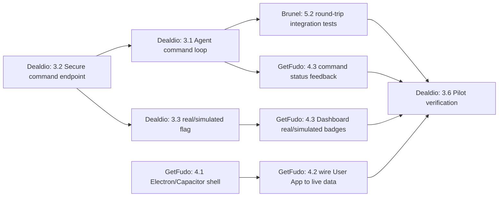

# Real Device Integration Readiness — Task Distribution

**Status**: Draft for team kickoff
**Owners**: GetFudo (Dashboard + User App frontend), Dealdio (real device integration + backend), Brunel (coordination, cross-cutting frontend/backend, review)
**Goal**: Close the remaining gaps between the current simulation-first platform and a production-ready real device management system, and assign concrete, independently-shippable tasks to each partner.

This document is based on a code-level audit of `backend/`, `frontend/`, and `user_app/` as of this writing. It builds on and does not duplicate the following existing docs — read those first for background:

- [docs/real-device-transition.md](../docs/real-device-transition.md) — architecture/roadmap so far
- [docs/real-device-agent.md](../docs/real-device-agent.md) — agent scaffold overview
- [docs/dealdio-user-app-tasks.md](../docs/dealdio-user-app-tasks.md) / [docs/getfudo-user-app-tasks.md](../docs/getfudo-user-app-tasks.md) — Part 1/2 preparatory work (mostly delivered)
- [docs/getfudo-preparatory-tasks.md](../docs/getfudo-preparatory-tasks.md) — API contracts already frozen
- [docs/device-enrollment-roadmap.md](../docs/device-enrollment-roadmap.md) — enrollment method split (delivered)

---

## 1. What's already in place (do not re-implement)

| Area | Status |
| --- | --- |
| Device registration + API key auth (`X-Device-ID` / `X-API-Key`) | ✅ Done |
| Device DNA capture (`os_details`, `mac_address`, `wan_ip`, `peripherals`) | ✅ Done |
| Agent heartbeat + telemetry loops with offline retry queue | ✅ Done (`backend/src/homepot/agent/real_device_agent.py`) |
| Agent local IPC server (`/status`, `/health`, `/last-telemetry`) | ✅ Scaffolded (`agent/utils/local_ipc.py`) |
| Device provisioning endpoint (`POST /api/v1/devices/provision`) | ✅ Done |
| Pre-provisioned vs self-enrolled devices (`enrollment_method`) | ✅ Done |
| Command queueing model + endpoints (`DeviceCommand`, `/devices/{id}/commands`, `/devices/pending`, `/commands/{id}/status`) | ✅ Endpoints exist |
| Peripheral discovery for printers (CUPS `lpstat`, Windows `Get-Printer`) + emulator toggle | ✅ Partial (printers only) |
| Dashboard command builder UI (`frontend/src/pages/Device/PushReview.jsx`) | ✅ Done |
| User App scaffold (`user_app/`) — Vite + React 19 views (SetupWizard, HomeDashboard, Permissions, DeviceInfo) | ✅ Static UI only |

## 2. Critical gaps found (drive the task list below)

1. **The agent never executes commands.** `real_device_agent.py` only runs `heartbeat_loop`, `telemetry_loop`, and `retry_flush_loop` — there is no loop polling `GET /devices/pending` or reporting results to `PUT /commands/{id}/status`. The command queue is backend-only right now; nothing on a real device ever acts on it.
2. **`POST /{device_id}/commands` has no authorization check.** Any caller can queue a command for any device (comment in code literally says "Admin/UI only - for now open"). This is a Broken Access Control gap that must close before going to real hardware.
3. **No real-vs-simulated distinction in the data model.** `Device` has no `source`/`is_simulated` flag, so the Dashboard can't filter or badge real devices, and simulated seed data can silently mix with production fleets.
4. **Agent has no packaging/deployment story.** `requirements-app.txt` exists, but there's no PyInstaller spec, build script, or service unit (systemd/Windows Service) to actually hand a binary to a pilot site.
5. **Peripheral discovery is incomplete.** Scanners and card readers are empty placeholders; Windows printer discovery returns raw PowerShell JSON instead of the normalized schema Linux/macOS uses.
6. **User App is a static mock, not a runtime shell.** No Electron/Capacitor wrapper, no SQLite, `HomeDashboard.tsx` hardcodes `MOCK_TELEMETRY` and `isOnline = true`, and nothing calls the agent's local IPC endpoints or the backend provisioning API yet.
7. **No secure local credential storage in the User App.** Token/device info handling is `localStorage`-only placeholder logic; needs to be replaced with OS keychain / secure storage once the Electron/Capacitor shell exists.

---

## 3. Dealdio — Real Device Integration & Backend

**Focus:** Close the command-execution loop, lock down security, finish device DNA fidelity, and make the agent deployable.

### 3.1 Command execution loop (highest priority)
- Add a `command_poll_loop` to `real_device_agent.py` that calls `GET /api/v1/devices/pending` on an interval (config field `command_poll_interval_seconds`).
- Implement an execution dispatcher keyed by `command_type` (start with `PING`, `RESTART_AGENT`, `APPLY_CONFIG`; stub unknown types as `FAILED` with a clear reason).
- Report outcomes via `PUT /api/v1/commands/{command_id}/status` with `COMPLETED`/`FAILED` and a `result` payload (stdout/exit code/error).
- Reuse the existing `RetryQueue` so status updates survive transient network loss.

### 3.2 Secure the command queue endpoint
- Add authorization to `POST /devices/{device_id}/commands` (admin/site-operator auth via existing `get_current_user`), matching the pattern already used elsewhere in the API.
- Add rate limiting / audit logging (reuse `audit.py`) for who queued which command.

### 3.3 Real vs. simulated device tracking
- Add a `source` (or `is_simulated: bool`) column to `Device` via an additive Alembic/SQLite migration (follow the pattern in `database.py`'s existing additive-column migrations, e.g. `peripherals`).
- Set this automatically: seed/simulation scripts mark `source=simulated`; `/devices/provision` and real registration mark `source=real`.
- Expose the field in device list/detail API responses.

### 3.4 Peripheral discovery completion
- Normalize `_get_windows_printers()` output to the same schema as `_get_cups_printers()` (parse the PowerShell JSON instead of returning `raw_output`).
- Implement real scanner and card-reader discovery (or explicitly document as out-of-scope for this phase if hardware isn't available for testing), replacing the empty placeholder lists.

### 3.5 Agent packaging & deployment
- Add a PyInstaller spec (Linux + Windows) producing a standalone `homepot-agent` binary using `requirements-app.txt` only (no FastAPI/SQLAlchemy).
- Provide a `systemd` unit file and a Windows Service wrapper/install script.
- Document install steps in `docs/real-device-agent.md`.

### 3.6 Pilot verification
- Register 3–5 real pilot devices (`physical_terminal` / `pos_terminal`), deploy the packaged agent, and confirm: online status, live telemetry, device DNA, peripheral list, and now command execution round-trips all show correctly on the Dashboard.

---

## 4. GetFudo — Dashboard & User App Frontend

**Focus:** Turn the User App from a static mock into a real runtime, and extend the Dashboard to reflect real-device state.

### 4.1 User App runtime shell (Milestone 1 from `getfudo-user-app-tasks.md`, not yet started)
- Add the Electron wrapper for desktop (Windows/macOS/Linux) and Capacitor 8 for Android to `user_app/`.
- Wire up build scripts (`electron-builder` / `cap sync`) alongside the existing Vite dev flow.

### 4.2 Wire the User App to real data
- Replace `MOCK_TELEMETRY` and hardcoded `isOnline = true` in `HomeDashboard.tsx` with live polling of the local agent IPC endpoints (`GET /status`, `/last-telemetry`) once Dealdio/Brunel's agent exposes them locally to the shell.
- Update `SetupWizard.tsx` to call `POST /api/v1/devices/provision` (or the pre-provisioned claim flow) instead of only writing to `localStorage`, and to persist the returned device credentials securely (OS keychain via Electron `safeStorage`, or Capacitor Secure Storage plugin) rather than plain `localStorage`.
- Surface command status/history (from the new `DeviceCommand` polling in the agent) in `DeviceInfo.tsx`.

### 4.3 Dashboard: real vs. simulated visibility
- Once Dealdio ships the `source`/`is_simulated` field, add a badge/filter in the device list and `DeviceDetail.jsx` to distinguish "Real" vs "Simulated" devices.
- Update `PushReview.jsx` / `DeviceHistory.jsx` command flows to show live `PENDING → COMPLETED/FAILED` transitions once the agent executes commands (currently there is no execution feedback loop to visualize).

### 4.4 Peripheral display
- Extend device detail views to render the (now-normalized) peripheral list — printers today, scanners/card readers once Dealdio lands them.

---

## 5. Brunel — Coordination, Cross-Cutting Frontend/Backend, Review

**Focus:** Keep the two workstreams integrated, own shared/ambiguous pieces, and gate quality.

### 5.1 Coordination & sequencing
- Command execution (3.1/3.2) and the real/simulated flag (3.3) are prerequisites for GetFudo's 4.2/4.3 — sequence PRs so backend contracts land (with updated `docs/getfudo-preparatory-tasks.md` contracts) before frontend consumes them.
- Maintain `agent-config.json` / `.env` contract changes (e.g., new `command_poll_interval_seconds`) as a single source of truth shared between Dealdio's agent and any Brunel/GetFudo tooling.

### 5.2 Cross-cutting implementation
- Add integration tests covering the full command round-trip: queue → agent poll → execute → status update → Dashboard reflects result (extend `backend/tests`).
- Extend `docs/security_architecture.mermaid` / `docs/audit-compliance.md` to document the new command-authorization model once 3.2 lands.
- Own the `start-dashboard.sh` / `start-userapp.sh` local dev scripts and keep them in sync as the User App gains an Electron/Capacitor build step.

### 5.3 Review & quality gates
- Review Dealdio PRs for: command-loop correctness, retry-safety, and that the new authorization check doesn't break existing device-facing endpoints (`get_current_device` vs `get_current_user` separation).
- Review GetFudo PRs for: secure credential storage (no plaintext API keys in `localStorage`/repo), and that Dashboard real/simulated badges match the backend contract.
- Update `docs/real-device-transition.md` "Roadmap to Production" table to mark Phase 3 (Command Execution) complete once 3.1–3.2 and their frontend consumption ship, and add a new "Phase 4: Fleet Pilot" entry for the 3.6 pilot rollout.

---

## 6. Suggested sequencing

## 7. Definition of "real device integration ready"

- [ ] Commands queued from the Dashboard are executed on a real device agent and status flows back within one poll interval.
- [ ] Command queue endpoint requires authenticated admin/operator access.
- [ ] Every device record is clearly tagged real or simulated, end-to-end (DB → API → Dashboard).
- [ ] Agent ships as an installable, packaged binary with a service definition, not just a source script.
- [ ] User App is a real Electron/Capacitor shell showing live IPC data, not static mock values.
- [ ] 3–5 physical pilot devices run the packaged agent successfully for at least one full day with no manual intervention.
