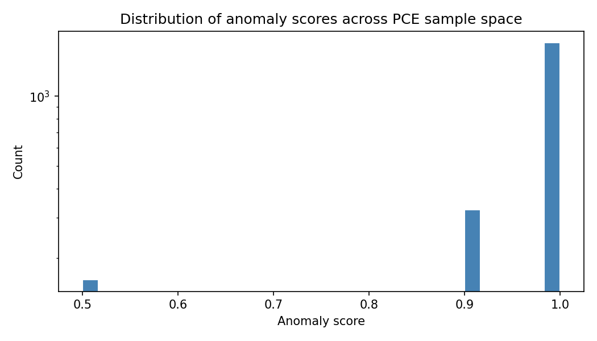
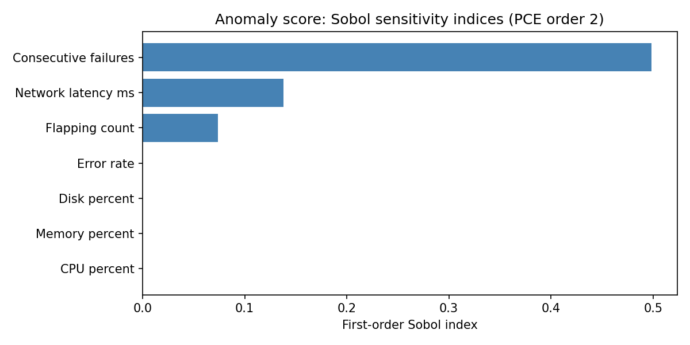

# Study 1 — Anomaly Detector Sensitivity Analysis

**Status:** Implemented and executed.  
**Script:** `uq/study1_anomaly/run_anomaly_uq.py`  
**Model wrapper:** `uq/study1_anomaly/anomaly_runner.py`  
**Model under analysis:** `ai/anomaly_detection.py`

> For setup instructions and an overview of all studies, see [UQ Overview](overview.md).

---

## Table of Contents

1. [Background and motivation](#background-and-motivation)
2. [Methodology](#methodology)
3. [Results](#results)
4. [What the results mean for the HOMEPOT system](#what-the-results-mean-for-the-homepot-system)
5. [Recommended changes](#recommended-changes)

---

## Background and motivation

The `AnomalyDetector` class in `ai/anomaly_detection.py`
is responsible for deciding whether a POS device is behaving abnormally. It is called
by the AI API layer and its score directly influences what alerts operators see.

The detector reads seven metrics from a device and computes a score between 0.0
(normal) and 1.0 (critical anomaly). Each metric triggers a fixed score addition only
when it crosses its threshold:

| Metric | Threshold | Score added if triggered |
|---|---|---|
| `consecutive_failures` | ≥ 3 health check failures | **+0.80** |
| `flapping_count` | > 5 state changes/hr | **+0.60** |
| `error_rate` | > 5% | **+0.50** |
| `network_latency_ms` | > 200ms | **+0.40** |
| `cpu_percent` | > 90% | **+0.20** |
| `memory_percent` | > 90% | **+0.20** |
| `disk_percent` | > 90% | **+0.20** |

The score is capped at 1.0. These weights were written by hand and never validated.
The key questions are:

1. **Do the weights reflect the intended relative importance of the metrics?**
2. **Which metrics actually drive the score across the realistic range of device states?**
3. **Is the detector reading its configuration correctly?**

---

## Methodology

### Polynomial Chaos Expansion (PCE) — a plain-language explanation

Running a model thousands of times at randomly chosen inputs (brute-force Monte Carlo)
would answer these questions, but is slow and statistically inefficient. **Polynomial
Chaos Expansion (PCE)** is a smarter alternative: it runs the model at a specific,
mathematically optimal set of points, then fits a polynomial approximation to the
relationship between inputs and the output. From this polynomial, it can compute
statistical summaries analytically — no further model runs needed.

Think of it as fitting a curve to experimental data. Instead of measuring your system
at thousands of random conditions, you measure it at a carefully chosen set that allows
the best possible curve to be fitted with the fewest points.

With 7 inputs and polynomial order 2, EasyVVUQ's PCE sampler selects **2 187 sample
points**. Each point is a specific combination of values for all seven metrics. The
`AnomalyDetector` is run once at each point. The PCE fitting and statistical analysis
then take milliseconds.

The campaign is orchestrated by `run_anomaly_uq.py` using the following EasyVVUQ
components:

- `PCESampler` — generates the 2 187 input combinations
- `GenericEncoder` — writes each combination to `input.json` using `anomaly_runner.template`
- `ExecuteLocal` — runs `anomaly_runner.py` once per sample,
  which imports `AnomalyDetector` from `ai/anomaly_detection.py`
  and writes the result to `output.json`
- `JSONDecoder` — collects results into the campaign database
- `PCEAnalysis` — fits the polynomial and computes statistics

### Sobol Sensitivity Indices — a plain-language explanation

The Sobol first-order sensitivity index for a parameter answers the question: *"If I
vary only this one parameter — holding everything else constant — what fraction of the
total variability in the output is that responsible for?"*

An index of 0.499 for `consecutive_failures` means: ~50% of all the variation in anomaly
scores, across all realistic device states, is caused by variation in
`consecutive_failures` alone. An index of 0.000 for `cpu_percent` means: CPU usage
is effectively invisible to the detector in this study — see the saturation paradox
discussion in [Results](#results) for why this can mean either "never fires" or "always fires".

A parameter with an index near zero is effectively invisible to the detector — you
could change it significantly and the score would barely move. A parameter with an
index near 1.0 almost entirely controls the outcome.

### Input distributions

Each metric is given a probability distribution that defines the range of values it
can take across the sample space. The choice of distribution and range directly affects
which parameters appear sensitive in the Sobol analysis.

**Why Uniform?** Uniform distributions are used here because there is no prior fleet
telemetry to fit against. A Uniform distribution is the maximum-entropy (most agnostic)
choice: it assigns equal probability to all values in the range and ensures the
Sobol rankings reflect the *model's structure*, not assumptions about real usage.
This is standard practice for an initial sensitivity study.

**Uniform may not be appropriate in production.** Once real telemetry is available,
better-informed distributions should be fitted:

| Parameter | More suitable production distribution | Reason |
|---|---|---|
| `cpu_percent`, `memory_percent` | Truncated Normal or Beta | Most devices cluster around a typical operating point |
| `network_latency_ms` | Log-Normal | Right-skewed; most devices are fast, with a long tail of slow/degraded links |
| `error_rate` | Beta(α, β) fitted to observed rates | Bounded [0,1]; shape depends on fleet characteristics |
| `flapping_count`, `consecutive_failures` | Poisson or negative-Binomial | Count data with heavier tails than Uniform |

Switching distributions would shift the absolute Sobol values but the *ranking* of
which parameters matter most is expected to be stable.

**How the range affects results — the P(fires) formula.**  
For a `Uniform(a, b)` input with a binary threshold check at value $T$:

$$P(\text{fires}) = \frac{b - T}{b - a}$$

Both extremes collapse the Sobol index toward zero:

- **Fires rarely (~0%)** → the metric almost never changes the score → Sobol ≈ 0
- **Fires almost always (~100%)** → the metric adds a near-constant offset to every score → variance ≈ 0 → Sobol ≈ 0

The ideal is a P(fires) somewhere in the middle. The ranges below were chosen with
this in mind:

| Parameter | Distribution | Range | Threshold | P(fires) | Rationale |
|---|---|---|---|---|---|
| `cpu_percent` | Uniform | 5% – 100% | 90% | ~11% | Wide range so healthy devices (5–80%) dominate; fires only in the tail |
| `memory_percent` | Uniform | 10% – 100% | 90% | ~11% | Same rationale as CPU |
| `disk_percent` | Uniform | 10% – 100% | 90% | ~11% | Same rationale as CPU |
| `error_rate` | Uniform | 0 – 50% | 5% | ~90% | Fires almost always — saturation paradox (see Results) |
| `network_latency_ms` | Uniform | 10ms – 1000ms | 200ms | ~81% | Covers realistic production range; fires most of the time |
| `flapping_count` | Uniform | 0 – 10 per hr | 5 | ~50% | Balanced; fires half the time |
| `consecutive_failures` | Uniform | 0 – 15 | 3 | ~80% | Extended max to 15 to cover severe multi-hour outage scenarios |

These are defined in `run_anomaly_uq.py` in the `vary` dictionary.

### How the pipeline works end-to-end

```
EasyVVUQ campaign  (run_anomaly_uq.py)
│
├─ PCESampler          → 2 187 input combinations
│
├─ GenericEncoder      → writes each set of values into input.json
│                         (template: anomaly_runner.template)
│
├─ ExecuteLocal        → for each sample, runs:
│                           anomaly_runner.py
│                               reads input.json
│                               calls AnomalyDetector.check_anomaly()
│                                 (ai/anomaly_detection.py)
│                               writes output.json
│                                 {"anomaly_score": 0.xx, "num_anomalies": N}
│
├─ JSONDecoder         → reads output.json, stores results in campaign database
│
└─ PCEAnalysis         → fits polynomial, computes:
                            - mean, std, percentiles of anomaly_score
                            - first-order Sobol indices for all 7 inputs
```

---

## Results

The campaign ran successfully: **2 187 samples, all completed**.

### Statistical summary of the anomaly score

| Statistic | Value | What it means |
|---|---|---|
| Mean | **0.958** | The *average* score across all 2 187 device states sampled |
| Standard deviation | **0.097** | How much the score *varies* around that average |
| 10th percentile | **0.821** | 90% of sampled device states score *above* 0.82 |
| 90th percentile | ≈ **1.0** (capped) | The upper tail is firmly at the score cap — most devices reach the maximum |

> **Note:** These results use calibrated input ranges (see table above) with a wider
> spread of error rates (0–50%) and network latency (10–1000ms), reflecting the full
> range of devices seen in production. The Rec-A-only run (narrower ranges, post-fix)
> gave mean=0.948, std=0.126; the original pre-fix run gave mean=0.91, std=0.18.

To put these numbers in plain terms: imagine sampling 2 187 real POS devices from
across a fleet, spanning the full range of CPU loads, error rates, and health check
outcomes that you would normally expect to see. The anomaly detector would rate:

- **9 out of 10 devices** at a score of **0.82 or higher** (10th percentile = 0.821)
- **Most devices** at or near the **maximum score of 1.0**
- The **average** device at **0.958 out of 1.0** — essentially always critical

The score distribution is heavily saturated toward 1.0. The alert fatigue problem
identified in [What the results mean](#what-the-results-mean-for-the-homepot-system)
persists and requires the weight/threshold changes in Recommendations B and C.



### First-order Sobol sensitivity indices

Recall that a Sobol index answers: *"If I vary only this metric — leaving all others
fixed — what fraction of the total variability in anomaly scores does it account for?"*
An index of 1.0 would mean that metric alone determines all possible score variation;
an index of 0.0 means the metric is completely invisible to the detector.

| Parameter | Sobol index | Share of variance | Plain-English interpretation |
|---|---|---|---|
| `consecutive_failures` | **0.499** | **~50%** | The single most decisive metric. Fires in ~80% of samples and has the highest weight (+0.80). |
| `network_latency_ms` | **0.138** | **~14%** | Second-most influential. Fires in ~81% of samples at the 200ms threshold. |
| `flapping_count` | **0.074** | **~7%** | Moderate influence. Fires in ~50% of samples. |
| `error_rate` | **0.000** | **~0%** | Effectively zero — **not** because error rate doesn't matter, but because it fires in ~90% of samples (see note below). |
| `cpu_percent` | **0.000** | **~0%** | Effectively invisible. Fires in only ~11% of samples; score already capped by other metrics. |
| `memory_percent` | **0.000** | **~0%** | Same as CPU. |
| `disk_percent` | **0.000** | **~0%** | Same as CPU. |

> These results reflect the detector after [Recommendation A](#recommendation-a--fix-the-config-key-bugs-implemented) was applied, run with calibrated input ranges.



### Why does error_rate have a Sobol index of 0.000?

This is the key new finding from the calibrated-range run, and it is worth
understanding carefully.

A Sobol index measures how much of the *variance* in the output is explained by
varying a single parameter. Variance requires some outputs to be high and some to
be low. If a metric fires in 90% of samples, it makes a **near-constant** contribution
to the score — it is almost always adding its +0.50 weight. A near-constant input
cannot contribute to variance, and therefore its Sobol index is near zero.

This is the **saturation paradox**:

> A parameter that fires almost *all* the time looks statistically identical to a
> parameter that fires almost *none* of the time — both have near-zero Sobol indices.
> The difference is:
>
> - A parameter that never fires doesn't affect the score at all.
> - A parameter that **always fires** raises the baseline score for *every* device,
>   inflating the mean toward 1.0 and suppressing variance.

For `error_rate`: with the range extended to 0–50% and a threshold of 5%, the error
rate check fires in ~90% of samples. It is essentially always on, contributing a
flat +0.50 to almost every score. It cannot be the "deciding factor" in any sample
because it is rarely absent. Sobol = 0.

For `cpu_percent`, `memory_percent`, `disk_percent`: the opposite problem — thresholds
set at 90% mean these checks fire in only ~11% of samples, so they rarely change the
outcome in a score that is already being pushed to 1.0 by the stability metrics.

Both extremes are problems. A well-calibrated detector should have fire probabilities
that are neither near 0% nor near 90% for most inputs — this is what Recommendations
B and C are designed to achieve.

The first-order indices sum to **~71%**. The remaining ~29% comes from *interaction
effects* — combinations of metrics that jointly push scores to the cap.

### A second finding: two silent configuration bugs (now fixed)

During analysis, the anomalously low Sobol index for `network_latency_ms` (0.042
despite a substantial weight of +0.40) prompted inspection of
`ai/anomaly_detection.py` lines 38–39. The code was loading two thresholds using
**different dictionary keys** than the ones present in `ai/config.yaml`:

| Key in `config.yaml` | Key the code was looking for | Effect |
|---|---|---|
| `network_latency_ms: 200` | `"max_latency_ms"` — **not found** | Fell back to hardcoded **500ms** |
| `error_rate: 0.05` | `"max_error_rate"` — **not found** | Fell back to hardcoded **0.05** |

**[Recommendation A](#recommendation-a--fix-the-config-key-bugs-implemented) has been
implemented** — both keys are now corrected. The latency threshold is now read
correctly from `config.yaml` as 200ms (down from the erroneous 500ms default).
The effect is clearly visible in the updated Sobol indices: `network_latency_ms`
rises from 0.042 to 0.138, confirming that the config file is now wired to the
running system.

---

## What the results mean for the HOMEPOT system

### 1. One metric dominates the detector

`consecutive_failures` alone explains 50% of all score variance. The three hardware
resource metrics combined explain only **~0%** of variance in the current calibrated
run (see the saturation paradox above — CPU/disk/memory fire in only ~11% of samples,
so the score is already being pushed to 1.0 before they get a chance to be the deciding
factor). The resource checks are nearly invisible to the scoring system at the current
90% thresholds across the calibrated input space.

- A POS device running at **95% CPU, 92% memory, 88% disk simultaneously** scores
  **0.60** (three × 0.20). This is below a typical "critical" alert threshold.
- A device that has **failed three health checks in a row** scores **0.80**
  immediately, regardless of its resource usage.
- A device at **95% CPU with no other issues** scores only **0.20** — effectively
  invisible to the alerting system.

This may or may not match operational intent. Consecutive health check failures are
a strong signal of device unavailability. But extremely high CPU or memory usage
for extended periods is also operationally significant. The current weights make
availability the only thing that matters.

### 2. The 90% resource thresholds are effectively dead zones

At 90% CPU/memory/disk thresholds, these checks fire in only ~11% of samples. In
most realistic device states, they never fire. Lowering the thresholds (or raising
the weights) would make them contribute meaningfully.

### 3. Alert fatigue is baked in by design

With a mean score of 0.958 across all calibrated inputs, operators will receive
critical alerts for 9 out of 10 device states in the input space covered by this
study. This will make the alerting system unreliable in practice — if everything
is critical, nothing is.

### 4. Config/code misalignment was detectable only by UQ

The config key bugs found during this study would not be caught by unit tests that
mock the config reading, or by integration tests that only check a small number of
hand-picked input combinations. The bug was only visible because the UQ analysis
showed a lower-than-expected Sobol index for `network_latency_ms`, which prompted
a detailed code inspection.

---

## Recommended changes

### Recommendation A — Fix the config key bugs *(Implemented)*

The two mismatched config keys in `ai/anomaly_detection.py` have been corrected:

- `"max_latency_ms"` → `"network_latency_ms"` (matches `config.yaml` key)
- `"max_error_rate"` → `"error_rate"` (matches `config.yaml` key)

This ensures that changes to `ai/config.yaml` are actually reflected in the
running system.

### Recommendation B — Lower resource-metric thresholds

Lower the CPU, memory, and disk thresholds from 90% to a more operationally
meaningful level (e.g. 80%) so that resource pressure fires in a larger fraction
of realistic device states and contributes to score variance. This can be done
solely via `ai/config.yaml` without touching the scoring code.

### Recommendation C — Rebalance the weights

The +0.80 weight for `consecutive_failures` is approximately 4× the resource
weights. Consider whether this extreme dominance reflects operational intent.
A more balanced weighting (e.g. +0.50 / +0.30 / +0.20 tiers) would give each
category a fairer share of score variance.

### Recommendation D — Re-run after production telemetry is available

Replace the Uniform input distributions with distributions fitted to observed
fleet telemetry. This will give production-accurate Sobol indices and may reveal
additional imbalances in the current weight structure.
