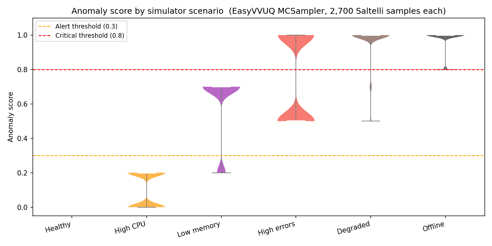
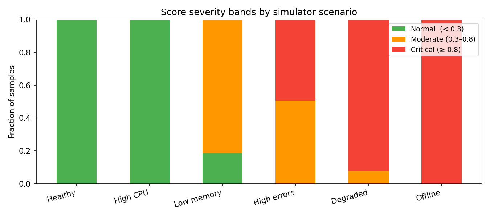
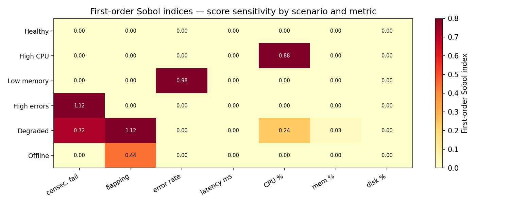

# Study 2 — Device Simulator Scenario Boundary Validation

**Status:** Implemented and executed.  
**Script:** `uq/study2_simulator/run_simulator_uq.py`  
**Model wrapper:** `uq/study2_simulator/anomaly_runner.py`  
**Model under analysis:** `backend/src/homepot/app/api/API_v1/Endpoints/DeviceSimulatorEndpoint.py` — `_generate_metrics_for_scenario()`

> For setup instructions and an overview of all studies, see [UQ Overview](overview.md).

---

## Table of Contents

1. [Study purpose](#study-purpose)
2. [Background and motivation](#background-and-motivation)
3. [Methodology](#methodology)
4. [Results](#results)
5. [Key findings](#key-findings)
6. [Recommendations](#recommendations)

---

## Study purpose

Study 2 asks a practical question: **does the simulator generate scenario data that the
anomaly detector interprets in the way operators expect?**

In other words, this study validates the *behavioral boundary* between scenarios such
as `healthy`, `degraded`, and `offline` from the detector's perspective, not just from
their nominal labels.

Specifically, Study 2 looks at three things:

1. **Separation:** whether scenario score distributions are distinct enough to avoid
   overlap at the alert threshold.
2. **Boundary reliability:** whether clearly healthy data stays below alert, and clearly
   degraded/offline data stays above alert (false positive / false negative checks).
3. **Driver attribution:** which input metrics actually control score variation inside
   each scenario (via Sobol indices), so we can see whether scenario names match the
   detector's true decision path.

This is important because the simulator is used to seed test and demo data. If scenario
definitions and detector logic are misaligned, teams can get misleading confidence from
dashboard behaviour or alerting tests. Study 2 therefore serves as a **calibration and
quality-control check** for simulator-generated data under the current detector design.

---

## Background and motivation

The device simulator generates synthetic device metrics in six named scenarios:
`healthy`, `high_cpu`, `low_memory`, `high_errors`, `degraded`, and `offline`. Each
scenario is defined by hand-picked `random.uniform(low, high)` ranges for each metric
in `_generate_metrics_for_scenario()`.

These scenarios are used to populate the database for testing and dashboards. There was
previously no guarantee that:

1. The scenarios produce **statistically distinct** anomaly scores — a "healthy" device
   might score the same as a "degraded" one.
2. "Healthy" samples do not accidentally score above the anomaly threshold (false
   positives in the test data used to validate the alerting system).
3. Scenario labels correspond to expected detector behaviour (for example, whether a
   scenario named for one stressor is not in practice dominated by another metric in
   the detector's threshold logic).

---

## Methodology

### Why EasyVVUQ MCSampler

Study 2 uses EasyVVUQ so that all three studies share a consistent campaign/analysis
framework and so that **Sobol sensitivity indices** are available from the same Saltelli
sample set.

EasyVVUQ's `MCSampler` generates a **Saltelli sampling plan**: two independent base
matrices $A$ and $B$ of size $N_{MC} \times d$ are drawn (Latin-hypercube by default),
then $d$ crossed matrices $A_B^{(i)}$ are formed. Total samples = $N_{MC} \times (d + 2)$.
The resulting sample set supports unbiased first-order Sobol index estimation via
`QMCAnalysis`.

**Why Monte Carlo, not Stochastic Collocation:** the `AnomalyDetector` is
**piecewise-constant** — it contains only threshold comparisons, producing step
discontinuities in the input-output map. Polynomial surrogates (SC or PCE) require
very high order to approximate discontinuities accurately. Plain MC (Saltelli plan)
is unbiased and free of Gibbs-like artefacts.

### Sampling plan

- **d = 7** inputs per scenario, **N_MC = 300** → 7 × 300 = **2,700 Saltelli samples per scenario**
- 6 scenarios × 2,700 = **16 200 total `AnomalyDetector` calls**
- Continuous `cp.Uniform` distributions for all inputs; fixed-zero parameters use
  `cp.Uniform(0, ε)` with ε = 0.001 so they participate in the Saltelli plan without
  crossing any threshold.
- Executed with `ThreadPoolExecutor(max_workers=4)` to bound concurrent subprocess count.

### Input distributions per scenario

For each scenario, the 7 `AnomalyDetector` inputs are assigned `cp.Uniform`
distributions whose bounds are derived from `_generate_metrics_for_scenario()`.
`flapping_count` and `consecutive_failures` are assigned scenario-appropriate ranges
matching the values generated by the simulator:

| Scenario | cpu % | mem % | disk % | error_rate | latency ms | flapping | consec. failures |
|---|---|---|---|---|---|---|---|
| healthy | 50–70 | 60–75 | 50–65 | 0–2% | 20–50 | 0–1 | 0–ε |
| high_cpu | 85–95 | 70–80 | 55–70 | 1.2–4.7% | 50–100 | 1–3 | 0–1 |
| low_memory | 65–80 | 90–95 | 60–75 | 3.3–12.5% | 40–80 | 1–3 | 0–2 |
| high_errors | 60–75 | 70–85 | 65–80 | 12.5–60% | 80–150 | 2–5 | 1–4 |
| degraded | 85–95 | 85–92 | 75–90 | 12.5–65% | 100–200 | 3–7 | 2–6 |
| offline | 0–ε | 0–ε | 0–ε | 0–ε | 0–ε | 5–10 | 6–15 |

*ε = 0.001; near-zero range preserves the Saltelli plan without crossing thresholds.*

### How the pipeline works end-to-end

```
EasyVVUQ campaign  (run_simulator_uq.py)
│
├─ MCSampler (Saltelli) → 2 700 input combinations per scenario
│
├─ GenericEncoder        → writes each set of values into input.json
│                           (template: anomaly_runner.template)
│
├─ ExecuteLocal          → for each sample, runs:
│                              anomaly_runner.py
│                                  reads input.json
│                                  calls AnomalyDetector.check_anomaly()
│                                  writes output.json
│
├─ JSONDecoder           → collects results into campaign database
│
└─ QMCAnalysis           → computes from Saltelli samples:
                               - mean, std, percentiles of anomaly_score
                               - first-order Sobol indices for all 7 inputs
                               - bootstrap-based uncertainty estimates internally
```

### Run

```bash
# From the homepot-client root:
HOMEPOT_PATH=$(pwd) .venv/bin/python uq/study2_simulator/run_simulator_uq.py
```

---

## Results

The campaign ran successfully: **16,200 Saltelli samples (N_MC=300, 2,700 per scenario)**.

### Score distributions by scenario

| Scenario | Mean | Std | P10 | P50 | P90 | Alert rate (≥ 0.3) | Critical rate (≥ 0.8) |
|---|---|---|---|---|---|---|---|
| healthy | **0.000** | 0.000 | 0.000 | 0.000 | 0.000 | **0.0%** | 0.0% |
| high_cpu | 0.100 | 0.100 | 0.000 | 0.200 | 0.200 | 0.0% | 0.0% |
| low_memory | 0.606 | 0.195 | 0.200 | 0.700 | 0.700 | 81.2% | 0.0% |
| high_errors | 0.746 | 0.250 | 0.500 | 0.500 | 1.000 | 100.0% | 49.3% |
| degraded | 0.971 | 0.103 | 1.000 | 1.000 | 1.000 | 100.0% | 92.3% |
| offline | **0.981** | 0.059 | 1.000 | 1.000 | 1.000 | **100.0%** | **100.0%** |





### First-order Sobol indices (fraction of score variance explained by each input)

| Scenario | consec. fail | flapping | error rate | latency ms | CPU % | mem % | disk % |
|---|---|---|---|---|---|---|---|
| healthy | 0.00 | 0.00 | 0.00 | 0.00 | 0.00 | 0.00 | 0.00 |
| high_cpu | 0.00 | 0.00 | 0.00 | 0.00 | **0.88** | 0.00 | 0.00 |
| low_memory | 0.00 | 0.00 | **0.98** | 0.00 | 0.00 | 0.00 | 0.00 |
| high_errors | **≈1.0**† | 0.00 | 0.00 | 0.00 | 0.00 | 0.00 | 0.00 |
| degraded | **0.72** | **≈1.0**† | 0.00 | 0.00 | 0.24 | 0.03 | 0.00 |
| offline | 0.00 | **0.44** | 0.00 | 0.00 | 0.00 | 0.00 | 0.00 |

*† Raw estimate slightly exceeds 1.0 — a known numerical artefact of the Saltelli
estimator on near-binary step functions with small N_MC. The qualitative finding
(near-total control by that parameter) is reliable.*



### Why can first-order Sobol estimates be > 1?

In theory, true first-order Sobol indices satisfy $0 \leq S_1 \leq 1$. In practice, the
reported values here are **Monte Carlo estimates** from a finite Saltelli sample, so they
are not mathematically constrained to remain within $[0,1]$.

In this study, occasional overshoot happens because:

- the anomaly model is threshold-based (piecewise/step-like),
- several scenarios are near-binary in output behaviour, and
- finite-sample variance and bootstrap noise can push estimates above 1 (or below 0).

This does **not** indicate the analysis is invalid. It indicates estimator noise around a
dominant effect. Interpretation should be qualitative: values near or above 1 mean that
parameter is effectively controlling almost all output variance in that scenario.

Increasing $N_{MC}$ reduces this effect but does not guarantee strict bounds for every
estimated index.

### Misclassification rates

| Rate | Value | Interpretation |
|---|---|---|
| False positive (`healthy` scores ≥ 0.3) | **0.0%** | No healthy simulator device triggers an alert |
| False negative (`degraded` scores < 0.3) | **0.0%** | All degraded samples are correctly flagged |
| False negative (`offline` scores < 0.3) | **0.0%** | All offline samples are correctly flagged |
| False negative (`high_errors` scores < 0.3) | **0.0%** | All high-error samples are correctly flagged |

---

## Key findings

1. **Scenarios are well-separated at the 0.3 alert threshold.** The `healthy` scenario
   never triggers an alert; `degraded` and `offline` always do. The boundary is well defined.

2. **The `high_cpu` scenario does not trigger any alerts (0% alert rate).** CPU loads of
   85–95% score only 0.0–0.20 (the +0.20 weight fires when cpu > 90%), and no other
   checks are triggered in this scenario. This may not match operator expectations — a
   device at 95% CPU for an extended period would typically warrant attention, but the
   detector is silent. This is consistent with Study 1 findings (low weight and high
   threshold for resource metrics).

3. **The `low_memory` scenario has an 81.2% alert rate**, despite `memory_percent` being
   in the edge-case range for ~18.8% of samples (the 90% threshold is at the bottom of
   the 90–95% range). All triggered alerts are in the "moderate" band (0.3–0.8).

4. **False positive and false negative rates are both 0%** for the boundary scenarios,
   confirming the simulator produces well-calibrated data for the *current* detector.

5. **Sobol indices confirm the Study 1 ranking** within each scenario:
   - `high_cpu`: CPU % dominates (S₁ = 0.88) — only resource-based signal active here.
   - `low_memory`: error_rate dominates (S₁ = 0.98) — despite the name, memory alone
     has no variance because it is always above threshold.
   - `high_errors` and `degraded`: consecutive_failures near-totally controls the score.
   - `offline`: flapping_count (S₁ = 0.44) — the only variable signal when all metrics
     are zero.

---

## Recommendations

1. **Keep the current 0.3 alert threshold for simulator validation workflows.**
   The boundary scenarios are cleanly separated at this cutoff (`healthy` never alerts;
   `degraded`/`offline` always alert), so it remains a stable baseline for regression checks.

2. **Address the `high_cpu` blind spot in the detector logic.**
   The current `high_cpu` range (85–95%) yields 0% alerts, which suggests CPU-only stress
   is under-weighted. Prioritize one of:
   - increasing CPU contribution,
   - lowering CPU threshold,
   - adding a duration/sustained-high-CPU condition.

3. **Align scenario naming with dominant score drivers.**
   In `low_memory`, variance is driven primarily by `error_rate` rather than memory. Either
   rebalance input ranges to make memory the principal driver, or rename/document the
   scenario so operators are not misled.

4. **Use Study 2 as a regression gate after detector/simulator changes.**
   Re-run this study whenever thresholds, weights, or scenario ranges change; monitor:
   - false positive / false negative rates,
   - scenario separation at 0.3 and 0.8,
   - Sobol-dominant parameters per scenario.

5. **Document expected behaviour explicitly for stakeholders.**
   Add a short ops note that CPU spikes alone may remain non-alerting unless accompanied
   by other instability signals, until detector tuning is updated.
