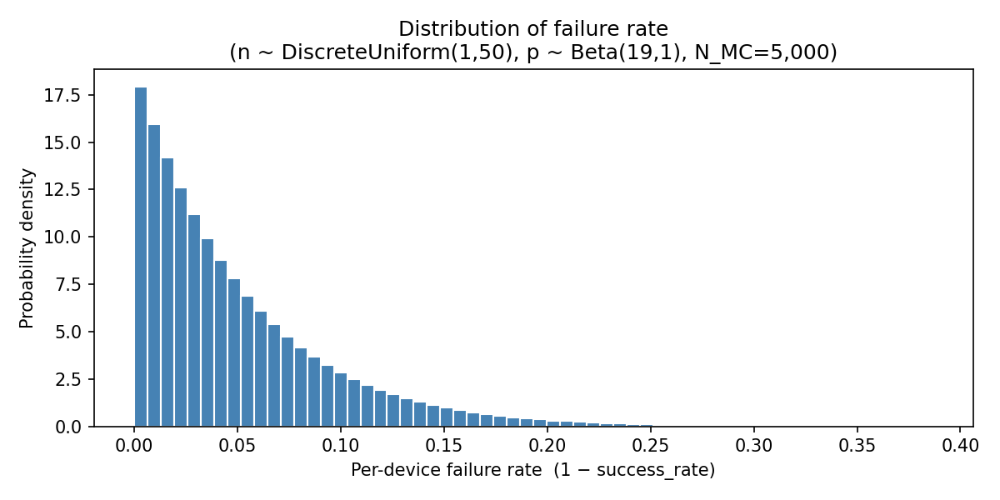
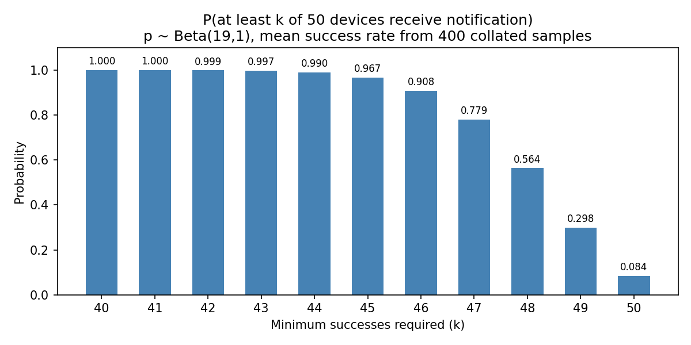
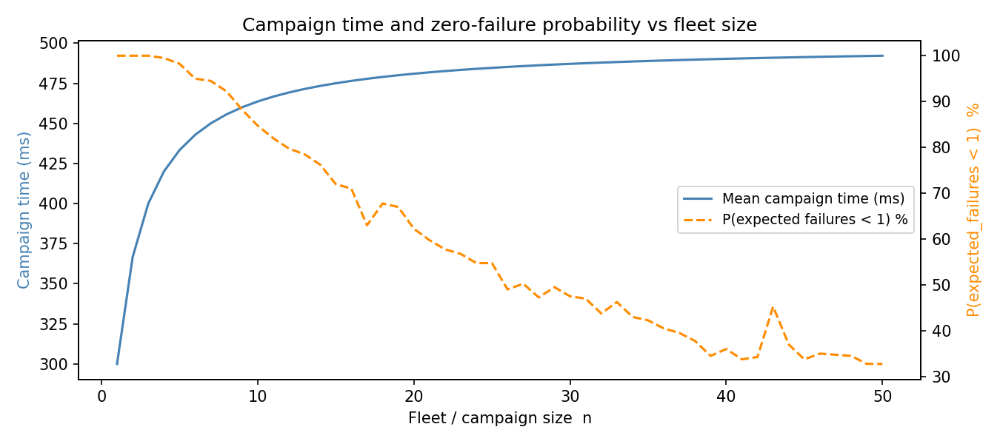
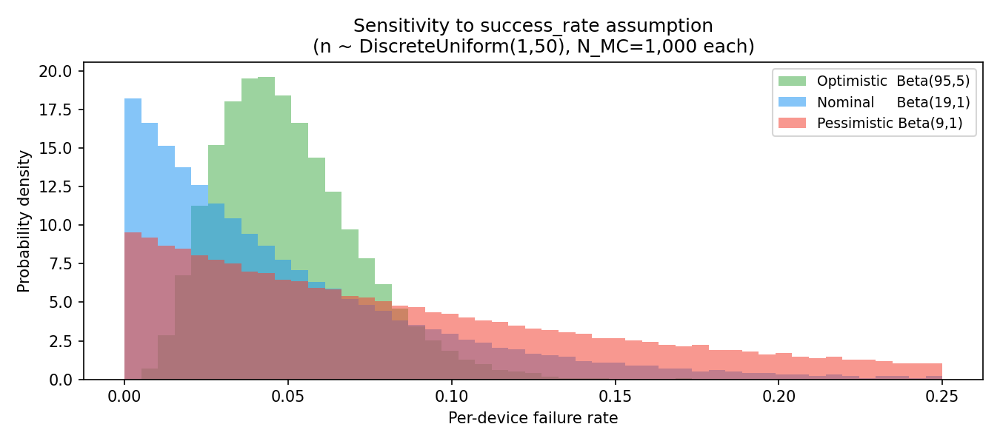

# Study 3 — Push Notification Delivery Reliability UQ

**Status:** Implemented and executed.  
**Script:** `uq/study3_push/run_push_uq.py`  
**Model runner:** `uq/study3_push/push_runner.py`  
**Model under analysis:** Push notification delivery (probabilistic model)

> For setup instructions and an overview of all studies, see [UQ Overview](overview.md).

---

## Table of Contents

1. [What this study tests](#what-this-study-tests)
2. [Model and assumptions](#model-and-assumptions)
3. [Methods](#methods)
4. [Results](#results)
5. [What the results mean](#what-the-results-mean)
6. [Recommendations](#recommendations)
7. [Limitations and next improvements](#limitations-and-next-improvements)

---

## What this study tests

### Problem statement

The current `SimulationProvider` assumes a fixed `success_rate=0.95`. In production,
delivery reliability and completion time vary across campaigns, but this uncertainty
is not currently quantified.

This study quantifies uncertainty for campaign outcomes, so product and engineering
teams can answer questions like:

- "If we notify 50 devices, what is the probability at least 45 receive it?"
- "How many failures should we expect on average, and in worse-decile cases?"
- "Which uncertainty matters most: per-device success probability or fleet size?"

### Primary outputs evaluated

- `expected_failures`: expected number of failed deliveries in a campaign
- `failure_rate`: expected per-device failure fraction
- `campaign_time_ms`: expected campaign completion time (max of concurrent delays)

---

## Model and assumptions

Each device's delivery outcome is a Bernoulli trial: success with probability $p$,
failure with probability $1-p$. With $n$ devices in a campaign and independent
deliveries:

$$\text{failures} \mid n, p \sim \text{Binomial}(n,\, 1-p)$$

The uncertain inputs are:

| Input | Distribution | Parameters | Mean | Notes |
|---|---|---|---|---|
| `success_rate` $p$ | Beta | $\alpha=19,\, \beta=1$ | 0.95 | Encodes "≈19 successes per 1 failure" — weakly informative prior |
| `num_devices` $n$ | DiscreteUniform | 1 – 50 | 25.5 | Full range of realistic campaign sizes |

Campaign completion time is the maximum delay across all $n$ concurrent deliveries:

$$\tau_{\text{campaign}} = \max(\tau_1, \ldots, \tau_n), \quad \tau_i \sim \text{Uniform}(100, 500\text{ ms})$$

$$\mathbb{E}[\tau_{\text{campaign}}] = 100 + 400 \cdot \frac{n}{n+1} \text{ ms}$$

### Deterministic expected-value runner

`push_runner.py` implements a **deterministic expected-value model** so that the Sobol
variance decomposition is well-defined and numerically stable:

| Output | Formula |
|---|---|
| `expected_failures` | $n(1-p)$ |
| `failure_rate` | $1-p$ |
| `campaign_time_ms` | $100 + 400\,\tfrac{n}{n+1}$ |

Post-collation $P(\text{at least }k\text{ succeed})$ is computed from
`scipy.stats.binom.cdf` applied to the mean success rate from the collated samples.

### Scope assumptions

- Independent device deliveries
- Uniform per-device delay in [100, 500] ms
- Campaign-level QoIs are expected values, not single stochastic realizations

These assumptions are reasonable for first-order UQ, but they likely under-represent
correlation effects (for example regional outages or gateway throttling).

---

## Methods

Study 3 uses the same **EasyVVUQ `MCSampler` + `QMCAnalysis`** framework as Study 2.

### Sampling plan

- **d = 2** inputs, **N_MC = 5,000** → **20,000 Saltelli samples** (main campaign)
- Three sensitivity campaigns at N_MC = 1,000 (→ 4,000 samples each) with alternative
  Beta priors on `success_rate`
- Executed with `ThreadPoolExecutor(max_workers=4)`

### Why this method

- Saltelli/QMC provides robust estimates of moments and Sobol sensitivity indices
- The deterministic runner isolates input uncertainty from Monte Carlo noise in the model evaluations
- Separate prior-sensitivity campaigns make assumption risk explicit

**Note on scipy compatibility:** chaospy 4.3.2 calls `scipy.special.btdtri` which
was removed in scipy ≥ 1.14. A one-line alias (`btdtri = betaincinv`) is applied
before chaospy is imported. This will be removable once chaospy is updated.

### How the pipeline works end-to-end

```
EasyVVUQ campaign  (run_push_uq.py)
│
├─ MCSampler (Saltelli) → 20 000 input combinations
│
├─ GenericEncoder        → writes each set of values into input.json
│                           (template: push_runner.template)
│
├─ ExecuteLocal          → for each sample, runs:
│                              push_runner.py
│                                  reads input.json
│                                  computes expected_failures, failure_rate,
│                                  campaign_time_ms analytically
│                                  writes output.json
│
├─ JSONDecoder           → collects results into campaign database
│
└─ QMCAnalysis           → computes:
                               - mean, std, percentiles of all three QoIs
                               - first-order Sobol indices for success_rate and num_devices
```

### Run

```bash
# From the homepot-client root:
HOMEPOT_PATH=$(pwd) .venv/bin/python uq/study3_push/run_push_uq.py
```

---

## Results

The campaign ran successfully: **20,000 Saltelli samples (N_MC=5,000)**.

### Main campaign (p ~ Beta(19,1), n ~ DiscreteUniform(1,50))

| QoI | Mean | Std | P10 | P90 | Unit |
|---|---|---|---|---|---|
| `expected_failures` | **1.27** | 1.55 | 0.07 | 3.21 | devices |
| `failure_rate` | **5.00%** | 4.75% | 0.55% | 11.4% | fraction |
| `campaign_time_ms` | **471.8** | 34.8 | 441.9 | 491.3 | ms |



### First-order Sobol indices

| QoI | success_rate | num_devices | Interpretation |
|---|---|---|---|
| `expected_failures` | **0.59** | 0.19 | Failure count driven mainly by the per-device rate, somewhat by fleet size |
| `failure_rate` | **≈1.0**† | 0.00 | Failure rate is a pure function of success_rate (by construction) |
| `campaign_time_ms` | 0.00 | **0.85** | Campaign time driven almost entirely by fleet size (saturation model) |

*† Estimate 1.016 — slightly exceeds 1.0 due to numerical noise on an exact functional relationship.*

### P(at least k of 50 devices succeed) — from mean success rate of n=50 subsample

| k | P(≥k succeed) |
|---|---|
| 40 | 100.0% |
| 41 | 99.99% |
| 42 | 99.94% |
| 43 | 99.74% |
| 44 | 99.02% |
| 45 | **96.75%** |
| 46 | 90.76% |
| 47 | 77.94% |
| 48 | 56.39% |
| 49 | 29.83% |
| 50 | **8.44%** |



### Campaign time and zero-failure probability vs fleet size



### Sensitivity to `success_rate` assumption

Three additional EasyVVUQ campaigns (N_MC = 1,000 each) explore how the Beta prior
on `success_rate` changes the failure rate distribution and Sobol decomposition:

| Prior | E[fail rate] | P10 fail rate | P90 fail rate | S₁(success_rate) | Notes |
|---|---|---|---|---|---|
| Optimistic Beta(95, 5) | 5.00% | 2.48% | 7.91% | ≈1.0 | Same mean 0.95, much tighter spread |
| **Nominal Beta(19, 1)** | **5.00%** | 0.55% | **11.40%** | ≈1.0 | Wider spread — best-decile near-zero, worst-decile 11% |
| Pessimistic Beta(9, 1) | **10.00%** | 1.16% | **22.55%** | ≈1.0 | Mean = 0.90; double the failures; up to 22% in worst-decile campaigns |

*S₁ estimates slightly exceed 1.0 due to Saltelli estimator noise on a near-exact
functional relationship (failure_rate = 1 − success_rate).*



---

## What the results mean

### Reliability interpretation

- Under the nominal prior, expected failures average **1.27 devices per campaign**,
  but uncertainty is broad (P90 = **3.21** expected failures).
- For campaigns of 50 devices, meeting a target of at least 45 successes has high but
  not guaranteed confidence: **96.75%**.
- Requiring near-perfect outcomes is unrealistic under current assumptions:
  $P(50/50) = 8.44\%$.

### Sensitivity interpretation

- `failure_rate` is almost entirely controlled by uncertainty in `success_rate`, as
  expected from the identity $\text{failure\_rate}=1-p$.
- `campaign_time_ms` is almost entirely controlled by `num_devices`; reliability
  uncertainty does not materially affect this time model.
- `expected_failures` is influenced by both, but primarily by `success_rate`.

### Decision interpretation

- Mean performance alone can hide risk. The optimistic and nominal priors share the
  same mean failure rate (5%), yet tail risk differs materially.
- If operational policy depends on high-confidence service levels (for example,
  "<5 failures with 95% confidence"), prior variance assumptions become a first-order
  decision variable.

---

## Recommendations

1. Use confidence-based SLOs for campaign reliability, not only mean failure rate.
2. Track and update an empirical posterior for `success_rate` from production logs;
   rerun this study periodically with refreshed priors.
3. Report two reliability views in product dashboards:
   - $P(\ge k\text{ successes} \mid n)$ for key thresholds
   - Worst-decile (P90/P95) expected failures
4. For large campaigns, design fallback behaviour explicitly for non-negligible shortfall
   probabilities (for example retries, delayed second wave, or channel failover).
5. Keep the deterministic UQ runner for sensitivity attribution, and complement it with
   scenario tests that include correlated failures.

---

## Limitations and next improvements

- Independence assumption may be optimistic; real outages are often correlated.
- Delay model is simple and may miss queueing/network saturation effects.
- The current $P(\ge k)$ summary uses a mean success rate from collated samples;
  a full posterior predictive treatment could better represent epistemic uncertainty.

Suggested next iteration:

1. Add a correlated-failure latent variable (for example campaign-level outage factor).
2. Compare independent vs correlated models on the same historical campaigns.
3. Add P95/P99 tail metrics and explicit risk thresholds to acceptance criteria.
