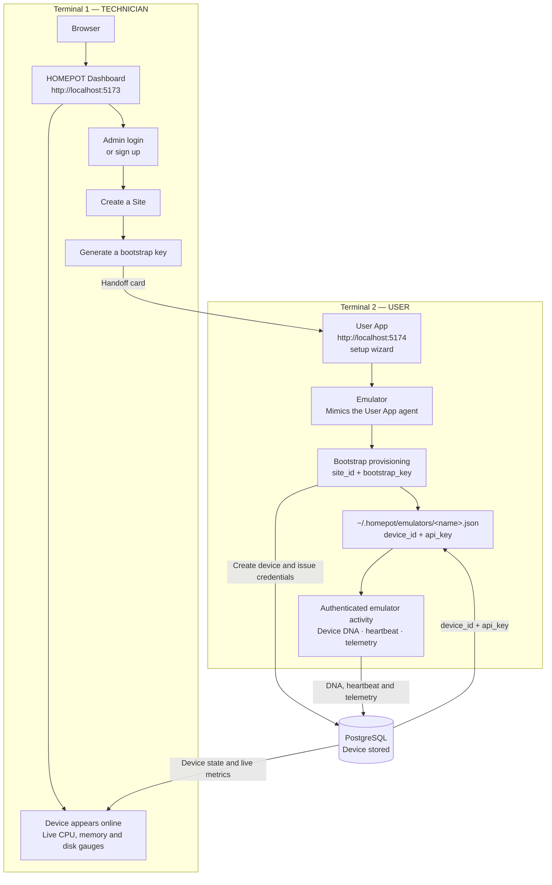

# Verifying the User App ↔ Dashboard flow with the emulator

A technician-style runbook for testing the HOMEPOT device setup flow locally,
mimicking a **User App on a real system** using the Linux POS emulator.



## What this verifies

1. An admin can create a **Site** and generate a **bootstrap key** for it.
2. A device can be provisioned into that site using only the site info handed
   to the "user" — no Dashboard login needed on the device side (this is the
   **User App** `bootstrap-provision` flow).
3. The provisioned device is stored correctly and appears on the **Dashboard**
   with mock DNA, online status, and live telemetry.
4. (Optional) Commands queued from the Dashboard are picked up and completed by
   the device.

## Prerequisites

- Repository cloned, Python venv at `.venv/`, backend deps installed
  (`pip install -r backend/requirements.txt`), frontend deps installed
  (`cd frontend && npm install`).
- PostgreSQL running with `homepot_db` initialized
  (`./scripts/init-postgresql.sh`).
- Node 20+ (22 recommended).
- Two terminals (or one terminal + one browser window). Everything below runs
  on a single machine; in a distributed test, "Terminal 1" and "Terminal 2"
  would be different machines and the **handoff card** below is what the
  technician sends to the user.

## Step 0 — Start the stack (Technician)

Start the backend and Dashboard with the agent simulation disabled. The legacy
simulator auto-attaches to every active POS device and writes fake telemetry /
random `health_state` — disabling it keeps the verification clean.

```bash
# in the repository root
export ENABLE_AGENT_SIMULATION=false
./scripts/start-dashboard.sh
```

> Alternatively edit `backend/.env` and set `ENABLE_AGENT_SIMULATION=false`,
> then run `./scripts/start-dashboard.sh`.

Confirm both are up:

```bash
curl http://localhost:8000/api/v1/health/health   # {"status":"healthy",...}
# open http://localhost:5173 (Dashboard)
```

## Step 1 — Technician: create a Site

Open http://localhost:5173 and log in. A seeded admin exists:

- **Email:** `admin@homepot.com`
- **Password:** `homepot_dev_password`

(or use the sign-up form and log in with your own account).

**Option A — via the Dashboard UI:** Sites → *Create Site*, then fill in:

| Field | Value (example) |
|-------|-----------------|
| Site Name | `Demo Site 1` |
| Site ID | `site-it-demo1` (must be unique) |
| Location | `localhost` |
| Description | *(optional)* |

Record the following values for the User App Setup wizard used later in this
runbook. The Site ID must match the site created above, and the bootstrap key
must be the key generated for that site in Step 2.

| Setup field | Value for this runbook |
| ----------- | ---------------------- |
| Site ID | `site-it-demo1` |
| Bootstrap Key | The generated key from Step 2, or `homepot-dev-emulator-key` for development-only emulator testing |
| Device Name | A unique name such as `demo-linux-pos-1` |
| Device Type | `POS Terminal` |
| Operating System | `Auto-detect` — this initially identifies the machine running the User App; selecting Linux POS later replaces it with the emulator OS |

Expected response: `200` with `{"message": "...", "site_id": "site-it-demo1", ...}`.

## Step 2 — Technician: generate a bootstrap key

> **Dev shortcut:** for emulator testing you can skip generating a key and use
> the well-known dev key `homepot-dev-emulator-key`. It is accepted **only**
> outside production and **only** for simulated/emulator devices
> (`provisioning_source=emulator`), so real devices still need a real key.

**Option A — via the Dashboard UI (recommended):** open the Site detail page for
the site just created and click **Bootstrap Key**. In the dialog, click
**Generate Bootstrap Key** — the key is shown once, with a copy button.

**Option B — via the API** (or the interactive Swagger UI at
http://localhost:8000/docs → Authorize with the token →
`POST /sites/{site_id}/bootstrap-key`):

```bash
curl -X POST http://localhost:8000/api/v1/sites/site-it-demo1/bootstrap-key \
  -H "Authorization: Bearer $TOKEN"
```

Expected response: `200` with a `data.bootstrap_key` value (~43 characters). The
plaintext key is returned only once — regenerate if it is lost.

## Step 3 — Hand off the site info to the User

Pass this card to the user (paste into the second terminal / another machine):

```
Backend URL:  http://localhost:8000
Site ID:      site-it-demo1
Bootstrap key: <the key from Step 2>
```

This is the only information the user's device needs — the bootstrap key is
what authorises a device to enrol itself into the site.

## Step 4 — User: start the User App, then run the emulator (device side)

In **Terminal 2**, first start the HOMEPOT **User App** — the device-side UI (the
"Digital Security Badge") the end user sees on their system:

```bash
# in the repository root (Terminal 2)
./scripts/start-userapp.sh
```

The **HOMEPOT Agent** Electron window opens with the setup wizard. Walk through
it with the handed-off site info: enter the **Site ID**, the **Bootstrap Key**, a
**Device Name**, and pick a device type. As you type the device name, the
wizard checks live that the name isn't already in use in the site (using
`POST /devices/check-name`) and blocks proceeding if it is.

Setup Step 1 uses a non-mutating pre-enrolment handshake:

1. Entering a Site ID prompts the user to enter the administrator-provided
  bootstrap key. The app does not reveal whether the Site ID exists by itself.
2. Once both values are present, `POST /devices/verify-bootstrap` verifies the
  pair and returns only a generic verified/not-verified result. The device-name
  field remains locked until this succeeds.
3. The unlocked device-name field calls `POST /devices/check-name`. **Next**
  remains disabled until the name is confirmed available and the other
  required fields are complete.

Changing the Site ID or bootstrap key clears both verification results and
locks the device-name field again. Changing the device name clears its previous
availability result immediately. Final provisioning repeats all authoritative
checks because the setup handshake does not reserve a name.

### Known validation gap — real-device OS detection

This runbook validates an emulated Linux device; it does not yet validate OS
detection on physical devices. In the Electron User App, **Auto-detect** uses
the native device-DNA bridge and falls back to browser platform information
only when that bridge is unavailable. Therefore, seeing **Windows** while the
User App runs on a Windows workstation is correct. After **Launch emulated
device** and **Linux POS** are selected, the review screen and provisioning
payload must instead show `Linux 6.8.0 (Debian 12)`. Android POS must similarly
show `Android 14`.

Track physical-device verification separately before calling real-device setup
validated:

- Run the packaged Electron User App on supported Windows and Linux devices.
- Confirm **Auto-detect** resolves to the physical device's OS on the review
  screen and in the backend `os_details` value.
- Confirm explicitly selecting an OS still overrides auto-detection.
- Add equivalent checks when native Android, iOS, or other OS clients are
  implemented. The current emulator launcher supports only Linux POS and
  Android POS identities.

> **Note:** in dev mode the wizard simulates completion with local dev
> credentials and does **not** call the backend. The actual backend-facing
> provisioning is performed by the emulator below, which speaks the same
> `POST /devices/bootstrap-provision` protocol as the User App's agent.

Still in **Terminal 2**, run the Linux POS emulator. It performs the same
`POST /devices/bootstrap-provision` call the User App's setup wizard makes, then
runs heartbeat/telemetry as the device would. It runs in the **background**,
logging to `logs/emulator.log` and recording its PID in `logs/emulator.pid`:

```bash
# in the repository root
./scripts/start-emulator.sh \
  --site-id site-it-demo1 \
  --bootstrap-key <key-from-step-2>
```

Use `--device-name` to avoid clashing with another run on the same machine:

```bash
./scripts/start-emulator.sh \
  --site-id site-it-demo1 \
  --bootstrap-key <key-from-step-2> \
  --device-name "demo-pos-1"
```

The script echoes `Emulator started (PID: ...)` on success. Watch the emulator's
own output as it registers DNA, then starts its loops:

```
tail -f logs/emulator.log
```

You should see:

```
============================================================
  HOMEPOT Linux POS Emulator
  Device:  demo-pos-1
  Backend: http://localhost:8000
  Mock DNA: hostname=linux-pos-001, MAC=02:42:ac:11:00:02, IP=192.168.1.100
============================================================

  Restored credentials for device pos_terminal-xxxxxxxx
  Registering device DNA ...
  Registered DNA: hostname=linux-pos-001, MAC=02:42:ac:11:00:02, IP=192.168.1.100

  Device ID: pos_terminal-xxxxxxxx
  API Key:   yyyyyy...
  Site ID:   site-it-demo1

  Starting loops (heartbeat=10.0s, telemetry=15.0s, commands=15.0s, logs=15.0s, audits=60.0s, jobs=30.0s, alerts=90.0s)

  [heartbeat] OK  (13:23:25)...
```

Stop it any time with `./scripts/stop-emulator.sh`.

Notes:

- The device credentials are saved to
  `~/.homepot/emulators/<device_name>.json`. Stopping and re-running the
  emulator **resumes** from those credentials instead of re-provisioning. To
  force a fresh provision, delete that file first.
- The emulator registers the device as an **emulated** device
  (`is_simulated=true`). A real User App would register it as a physical
  device; everything else in the flow is identical.

## Step 5 — Technician: verify on the Dashboard

Back in **Terminal 1** / the Dashboard browser:

1. **Devices** page — the new device appears with its mock hostname/MAC/IP and
   an **online** status (driven by heartbeats).
2. **Device detail** page — the CPU / memory / disk gauges update every ~15s as
   telemetry arrives.
3. **Device detail → Live Logs** tab — real-time POS log lines appear (info /
   warning / error) as the emulator reports them via `POST /agent/logs`.
4. **Device detail → Audit Trail** tab — real-time audit events appear (e.g.
   `agent_started`, `health_check_performed`, `config_update_applied`) as the
   emulator reports them via `POST /agent/audit`.
5. **Device detail → Job History** tab — jobs appear as *pending* then flip to
   *completed* / *failed* as the emulator reports them via `POST /agent/jobs`.
6. **Device detail → Alerts** tab — within a few minutes a network-latency alert
   (e.g. `High Latency: 474ms`) appears, injected by the emulator via
   `POST /agent/alert` (configurable `alerts_interval_seconds`).
7. *(Optional)* queue a command (e.g. `ping` or `restart`) from the device
   detail page — within a few seconds `logs/emulator.log` shows it being ACKed
   and completed, and the Dashboard records the result.
8. *(Optional)* **Compose Command** — from the device detail page, open
   **Compose Command**, pick a command (e.g. `RUN_DIAGNOSTICS` or
   `APPLY_CONFIG`), edit the parameters/envelope, and click **Push Command**.
   The backend relays the composed payload into the device command queue
   (`POST /agents/{device_id}/push`), the emulator ACKs it, applies/executes
   the action (config update, app restart, or health check) and completes it.
   A `Command received: <name> (action) | ...` line appears in the **Live
   Logs** tab, and the command is recorded in **Push History** (`/device/{id}/history`,
   backed by device `ConfigurationHistory` entries) with the applied settings /
   test outcomes shown in its details.

   To see a **failed** push end-to-end, restart the emulator with
   `--command-failure-rate 1.0` (so every pushed config/restart/custom command
   fails) and push again: the command is reported as `failed` on the device, an
   **error-level** line appears in **Live Logs**, and Push History shows a red-X
   entry whose title/details carry the failure reason (e.g. *Configuration
   download failed: Connection timeout*). Restart without the flag to return to
   the default ~10% failure rate. Restart via
   `./scripts/stop-emulator.sh && ./scripts/start-emulator.sh --command-failure-rate 1.0`.

## Troubleshooting

| Symptom | Cause / fix |
|---------|-------------|
| "Device name ... already in use" (400) | A live device in the site already uses that name (case-insensitive). Pick a different name, or retire/unpair the old device first. |
| Device never appears on the Dashboard | Bootstrap key typo, or wrong `--site-id`. The key is single-use-ish — generate a new one in Step 2. |
| Emulator re-provisions but Dashboard shows the old device | Stale credentials file — delete `~/.homepot/emulators/<device_name>.json` and re-run **with a different `--device-name`** (the old name is still registered and the duplicate check will reject it). |
| `health_state` shows `error` on a healthy device | The legacy simulator was enabled (`ENABLE_AGENT_SIMULATION=true`). Restart the backend with it disabled (Step 0). |
| Two emulators clash on one machine | Use different `--device-name` values (each gets its own credentials file). |
| Dashboard frontend can't reach the backend | Confirm the backend is up and CORS is configured; `curl http://localhost:8000/` should return `{"message":"I Am Alive"}`. |

## Related documentation

- [Device emulators](device-emulators.md) — emulator internals, config reference, credential storage
- [Complete dashboard setup](complete-dashboard-setup.md) — Dashboard UI walk-through
- [Running locally](running-locally.md) — backend/frontend setup and commands
- [User App guide](user-app-frontend-guide.md) — the Electron device-management UI
- [Real device agent](real-device-agent.md) — production agent for physical hardware
