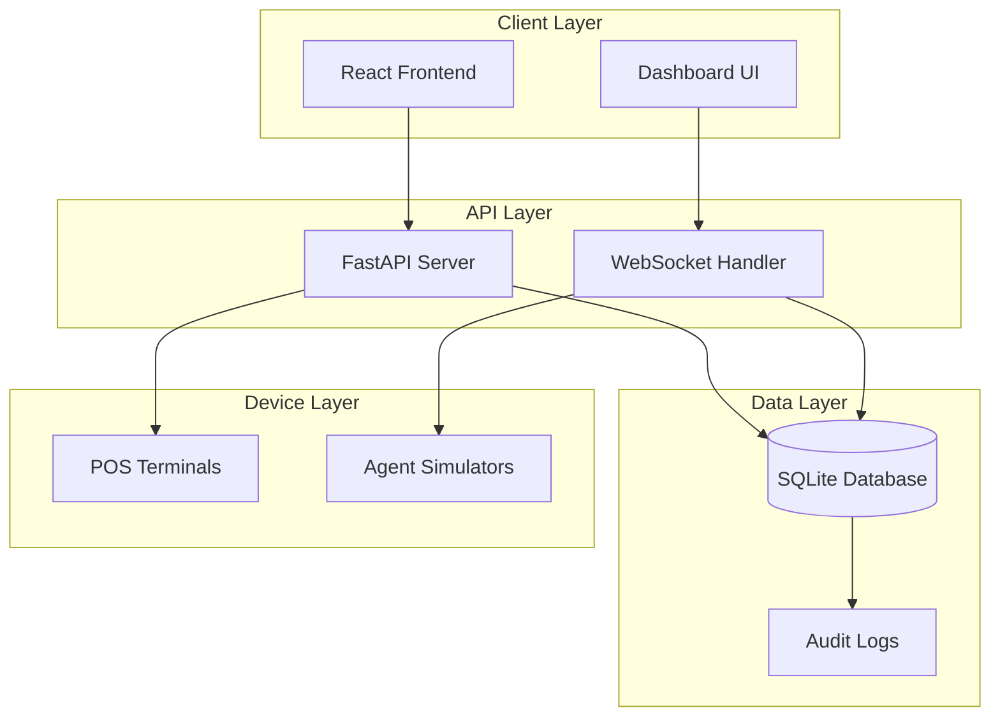
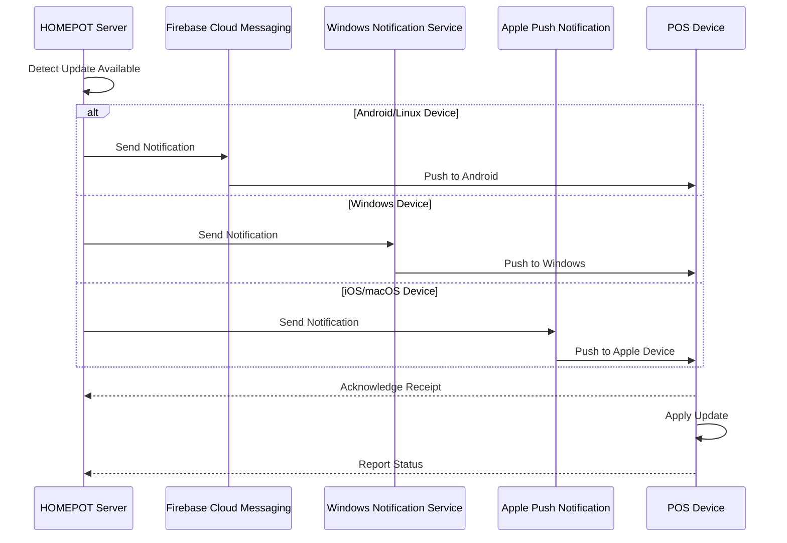
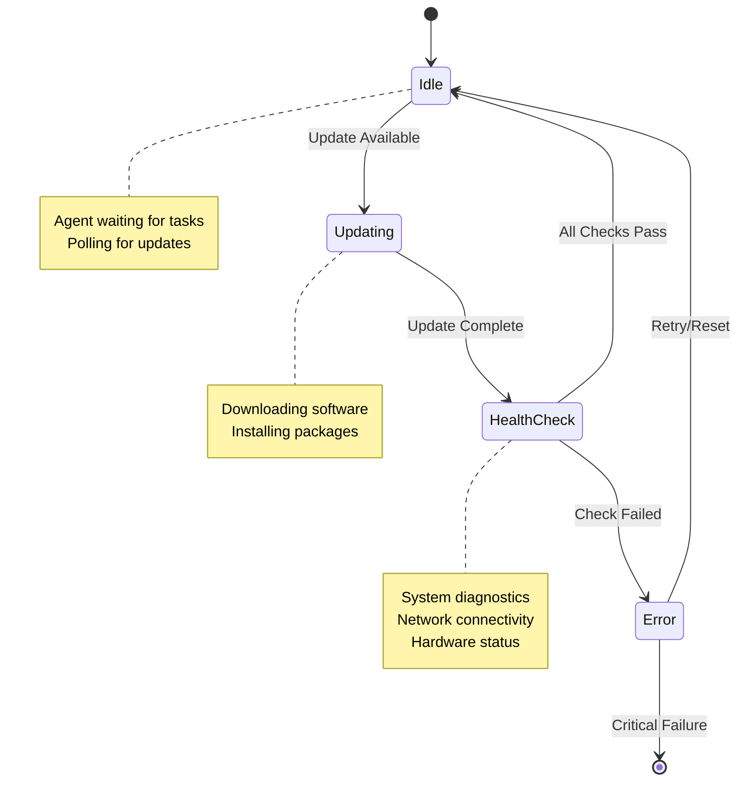
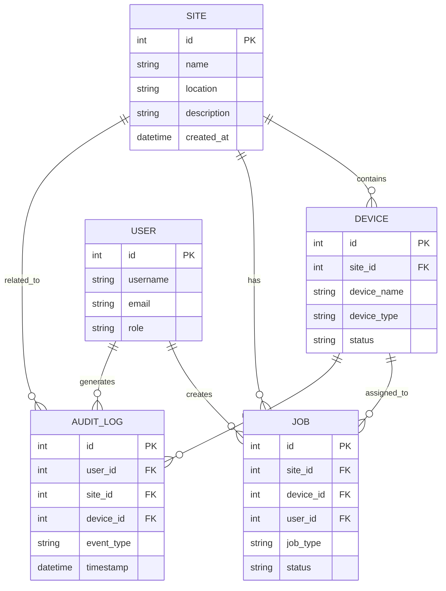
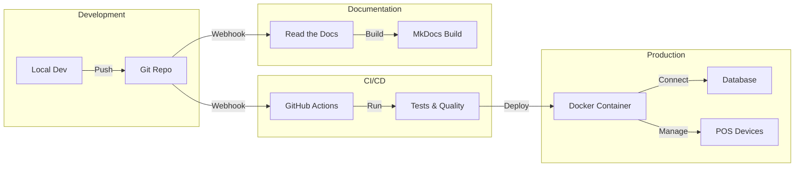
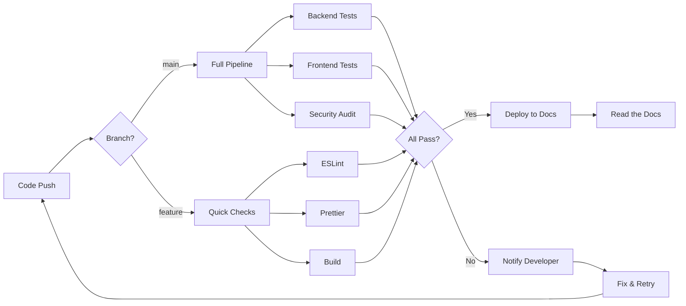

# Visual Examples for Documentation

This page demonstrates various visual elements available in HOMEPOT documentation.

## Mermaid Diagrams

### System Architecture (Flowchart)



### Push Notification Flow (Sequence Diagram)



### Agent State Machine



### Database Entity Relationships



### Deployment Architecture



### CI/CD Pipeline



### Agent Lifecycle (Timeline)

```mermaid
gantt
    title POS Agent Daily Lifecycle
    dateFormat HH:mm
    axisFormat %H:%M
    
    section Initialization
    System Boot           :done, boot, 00:00, 00:05
    Connect to Server     :done, connect, 00:05, 00:10
    
    section Operations
    Idle Monitoring       :active, idle1, 00:10, 08:00
    Morning Transactions  :crit, trans1, 08:00, 12:00
    Idle Period          :idle2, 12:00, 13:00
    Afternoon Transactions:crit, trans2, 13:00, 18:00
    
    section Maintenance
    Check for Updates     :update, 18:00, 18:30
    Health Check         :health, 18:30, 19:00
    Idle Monitoring      :idle3, 19:00, 23:59
```



## Image Placeholders

### Logo Example

<div align="center">
  <p><em>Logo placeholder - Add your logo to <code>docs/images/logos/homepot-logo.png</code></em></p>
  <!-- { width="200" } -->
</div>

### Screenshot Example

<figure markdown>
  <p><em>Screenshot placeholder - Add screenshots to <code>docs/images/screenshots/</code></em></p>
  <!--  -->
  <figcaption>Real-time Dashboard Interface (placeholder)</figcaption>
</figure>

### Diagram Example

<figure markdown>
  <p><em>Diagram placeholder - Add diagrams to <code>docs/images/diagrams/</code></em></p>
  <!--  -->
  <figcaption>HOMEPOT System Architecture (placeholder)</figcaption>
</figure>

## Icons and Badges

### Platform Support

<div class="grid" markdown>

- :material-linux:{ .lg .middle } **Linux**
  
  Ubuntu, Debian, CentOS

- :material-microsoft-windows:{ .lg .middle } **Windows**
  
  Windows 10, 11, Server

- :material-apple:{ .lg .middle } **macOS**
  
  macOS 10.15+

</div>

### Feature Highlights

<div class="grid cards" markdown>

- :material-clock-fast:{ .lg .middle } **Real-time**

    WebSocket-powered live monitoring

- :material-shield-check:{ .lg .middle } **Secure**

    Enterprise-grade security

- :material-scale-balance:{ .lg .middle } **Compliant**

    Audit-ready logging

- :material-api:{ .lg .middle } **API First**

    RESTful API design

</div>

## Status Indicators

| Status | Icon | Description |
|--------|------|-------------|
| Online | :material-check-circle:{ style="color: green" } | Device is operational |
| Updating | :material-update:{ style="color: blue" } | Receiving updates |
| Warning | :material-alert:{ style="color: orange" } | Attention needed |
| Offline | :material-close-circle:{ style="color: red" } | Device unavailable |

## Code Examples with Annotations

```python title="database.py" linenums="1" hl_lines="3 8-10"
from sqlalchemy import create_engine
from sqlalchemy.orm import sessionmaker
from .models import Base  # (1)

DATABASE_URL = "sqlite:///data/homepot.db"

engine = create_engine(DATABASE_URL, echo=True)
SessionLocal = sessionmaker(
    autocommit=False,
    autoflush=False,  # (2)
    bind=engine
)

def get_db():
    db = SessionLocal()
    try:
        yield db  # (3)
    finally:
        db.close()
```

1. Import database models
2. Disable autoflush for better control
3. Yield session for dependency injection

## Admonitions (Callout Boxes)

!!! note "Getting Started"
    Visit the [Getting Started Guide](getting-started.md) for installation instructions.

!!! tip "Pro Tip"
    Use `mkdocs serve` to preview documentation locally before committing.

!!! warning "Important"
    Always backup your database before running migrations.

!!! danger "Security Alert"
    Never commit API keys or credentials to version control.

!!! success "Build Passed"
    All tests passed successfully!

!!! example "Example Usage"
    ```bash
    homepot-client run --host 0.0.0.0 --port 8000
    ```

## Tabs

=== "Python"

    ```python
    from homepot import Client
    
    client = Client()
    devices = client.get_devices()
    ```

=== "JavaScript"

    ```javascript
    import { HomepotClient } from 'homepot-client';
    
    const client = new HomepotClient();
    const devices = await client.getDevices();
    ```

=== "cURL"

    ```bash
    curl -X GET http://localhost:8000/api/devices
    ```

## Progressive Disclosure

??? question "How do I add a new site?"
    See the [Database Guide](database-guide.md#adding-sites) for detailed instructions.

??? question "How do I configure push notifications?"
    Check out the platform-specific guides:
    
    - [FCM for Linux/Android](fcm-linux-integration.md)
    - [WNS for Windows](wns-windows-integration.md)
    - [APNs for Apple devices](apns-apple-integration.md)

??? tip "Performance Optimization"
    For better performance:
    
    1. Enable database indexing
    2. Use connection pooling
    3. Implement caching
    4. Monitor with the real-time dashboard

## Quick Reference

For more visual examples and usage instructions, see:

- **[Images Directory README](images/README.md)** - Comprehensive guide to images
- **[Images Quick Reference](images/QUICKREF.md)** - Quick examples

---

*This page demonstrates the visual capabilities of HOMEPOT documentation. Add your own images, diagrams, and screenshots to enhance your documentation!*
